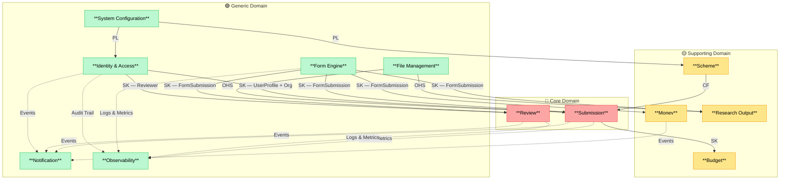
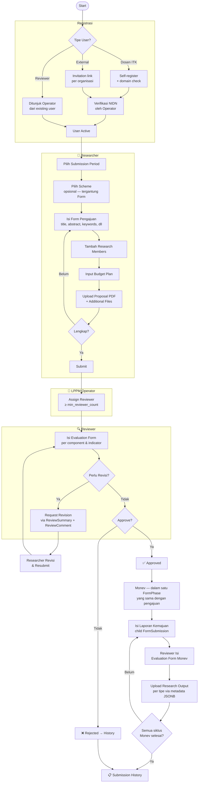
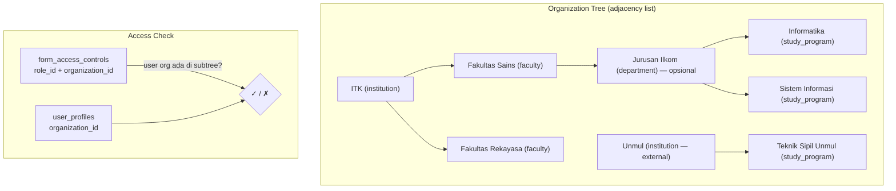
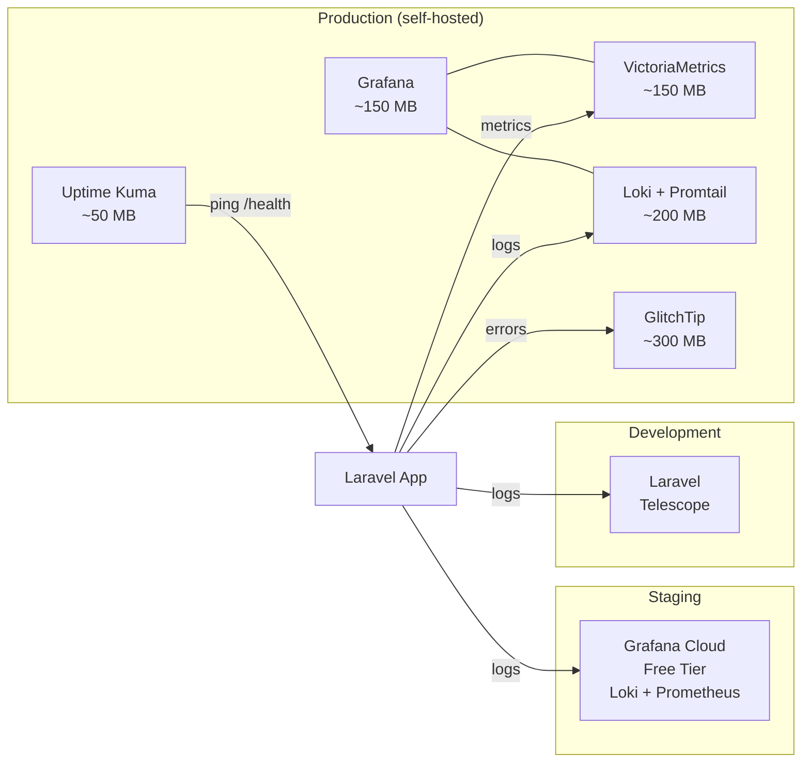

# 01 — Domain Map

**Versi:** 2.1  
**Status:** Draft

---

## Klasifikasi Domain

| Klasifikasi       | Bounded Context      | Alasan                                                     |
| ----------------- | -------------------- | ---------------------------------------------------------- |
| 🔴 **Core**       | Submission           | Lifecycle pengajuan proposal — inti bisnis SIMPAS          |
| 🔴 **Core**       | Review               | Approval workflow yang membedakan sistem ini               |
| 🟡 **Supporting** | Budget               | Penting tapi tidak differentiating                         |
| 🟡 **Supporting** | Monev                | Penting tapi tidak differentiating                         |
| 🟡 **Supporting** | Research Output      | Pelaporan luaran penelitian                                |
| 🟡 **Supporting** | Scheme               | Katalog skema yang dikontrol admin                         |
| 🟢 **Generic**    | Form Engine          | Platform inti dari sim-kerjasama — form, phase, submission |
| 🟢 **Generic**    | Identity & Access    | Auth, org tree, tiga jalur registrasi                      |
| 🟢 **Generic**    | Notification         | Laravel Notification                                       |
| 🟢 **Generic**    | File Management      | MinIO / Cloudflare R2                                      |
| 🟢 **Generic**    | System Configuration | Master data (tipe jurnal, tipe HKI, dll)                   |
| 🟢 **Generic**    | Observability        | Logging, metrics, error tracking, uptime monitoring        |

---

## Bounded Context Map



---

## Main Business Flow



---

## Organization + Access Model



---

## Observability Stack per Environment



---

## Implementation Priority

```
Phase 1 — Foundation
├── System Configuration   (zero dependency)
├── Identity & Access      (org tree + auth + 3 registration flows)
├── File Management
└── Observability          (Telescope di dev, siapkan stack prod dari awal)

Phase 2 — Platform
├── Form Engine            (Form, Phase, Submission — inti sim-kerjasama)
└── Scheme                 (decoupled dari Form, scheme_selector field type)

Phase 3 — Core Features
├── Submission             (extension tables: members, budget)
└── Budget

Phase 4 — Review Workflow
└── Review                 (reviewer_internal + reviewer_external Spatie roles)

Phase 5 — Post-Approval
├── Monev                  (FormPhaseDetail dalam lifecycle yang sama)
└── Research Output        (single table + JSONB metadata)

Phase 6 — Cross-cutting
└── Notification
```
