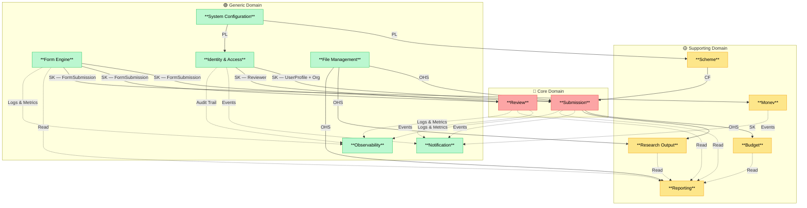
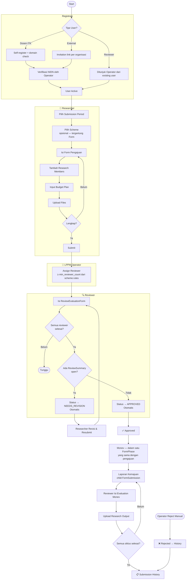
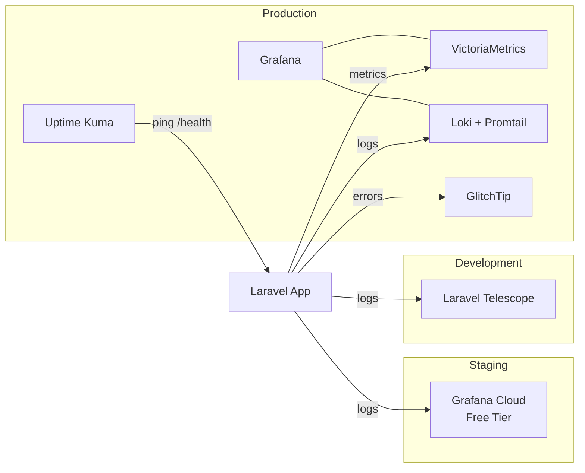

# 01 — Domain Map

**Versi:** 2.3  
**Status:** Draft

---

## Klasifikasi Domain

| Klasifikasi       | Bounded Context      | Alasan                                                     |
| ----------------- | -------------------- | ---------------------------------------------------------- |
| 🔴 **Core**       | Submission           | Lifecycle pengajuan proposal — inti bisnis SIMPAS          |
| 🔴 **Core**       | Review               | Approval workflow yang membedakan sistem ini               |
| 🟡 **Supporting** | Budget               | Penting tapi tidak differentiating                         |
| 🟡 **Supporting** | Monev                | Penting tapi tidak differentiating                         |
| 🟡 **Supporting** | Research Output      | Pelaporan luaran penelitian                                |
| 🟡 **Supporting** | Scheme               | Katalog skema yang dikontrol admin                         |
| 🟡 **Supporting** | Reporting            | Export, statistik, audit trail, cetak dokumen              |
| 🟢 **Generic**    | Form Engine          | Platform inti dari sim-kerjasama — form, phase, submission |
| 🟢 **Generic**    | Identity & Access    | Auth, org tree, tiga jalur registrasi                      |
| 🟢 **Generic**    | Notification         | Laravel Notification                                       |
| 🟢 **Generic**    | File Management      | MinIO / Cloudflare R2                                      |
| 🟢 **Generic**    | System Configuration | Master data (tipe jurnal, tipe HKI, dll)                   |
| 🟢 **Generic**    | Observability        | Logging, metrics, error tracking, uptime                   |

---

## Bounded Context Map



---

## Main Business Flow



---

## Observability Stack per Environment



---

## Implementation Priority

```
Phase 1 — Foundation
├── System Configuration
├── Identity & Access
├── File Management
└── Observability

Phase 2 — Platform
├── Form Engine
└── Scheme

Phase 3 — Core Features
├── Submission
└── Budget

Phase 4 — Review Workflow
└── Review

Phase 5 — Post-Approval
├── Monev
├── Research Output
└── Reporting

Phase 6 — Cross-cutting
└── Notification
```
