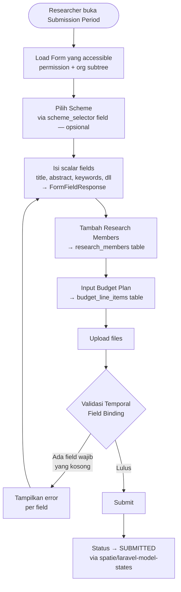
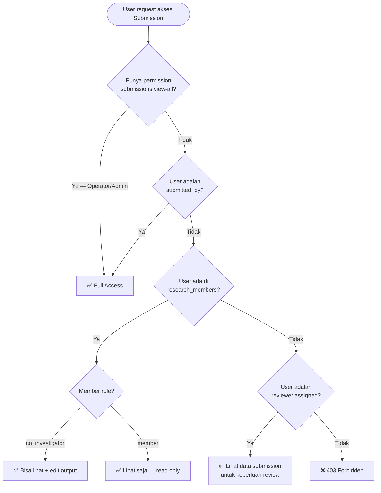
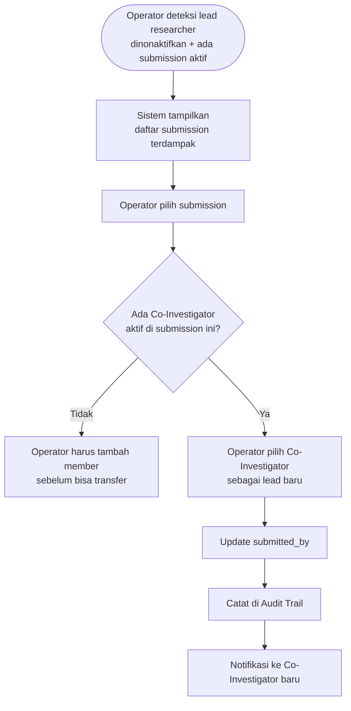
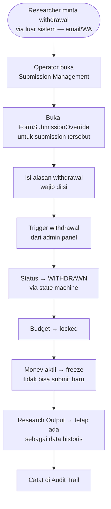
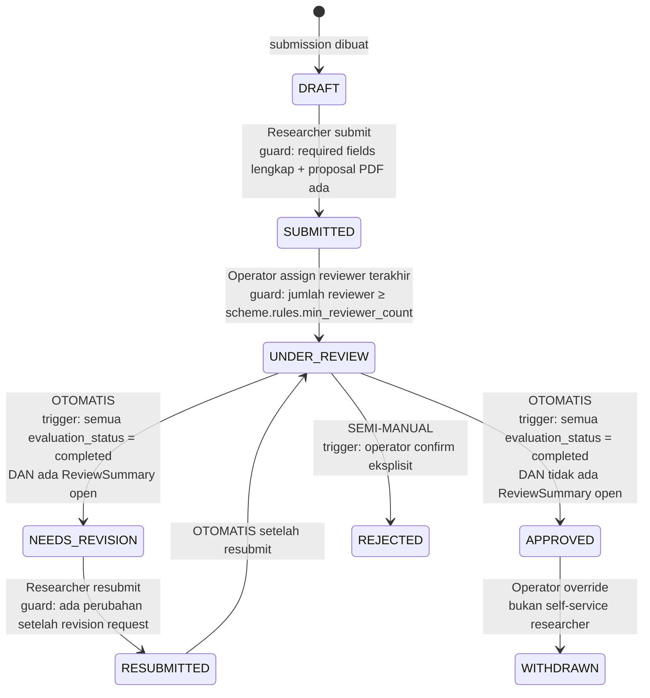
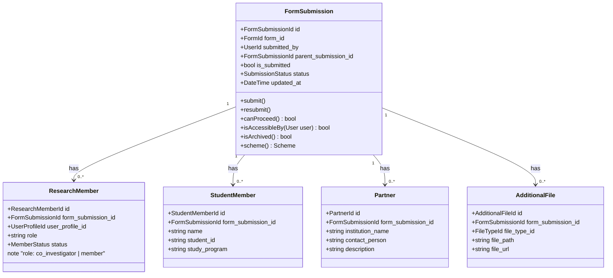

# BC: Submission

**Klasifikasi:** 🔴 Core Domain  
**Versi:** 2.3  
**Status:** Draft

---

## Responsibility

Mengelola lifecycle lengkap pengajuan proposal penelitian/pengabdian. Menggunakan `FormSubmission` dari Form Engine sebagai basis, diperluas dengan extension tables. Menyediakan dua lapis access control: form-level (via FormAccessControl) dan submission-level (via submitted_by + research_members).

---

## Activity Diagram

### Alur Pembuatan & Submit

### Submission-Level Access Check

### Transfer Ownership

### Withdrawal setelah APPROVED

---

## State Machine

Menggunakan **`spatie/laravel-model-states`**.

---

## Aggregates

---

## ⚠️ Feature Gap — Belum Ada di Fork

| Fitur                   | Yang Harus Dibuat                                                                             |
| ----------------------- | --------------------------------------------------------------------------------------------- |
| Research Member input   | Tabel `research_members`, UI member picker, permission visibility, conflict of interest check |
| Budget Plan input       | Tabel `budget_line_items`, dynamic table UI, auto-calculate                                   |
| Partner input           | Tabel `submission_partners`, UI                                                               |
| Scheme integration      | Tabel `schemes`, field type `scheme_selector` + `trl_selector`                                |
| `parent_submission_id`  | Kolom di `form_submissions` (untuk laporan monev + kelengkapan saja)                          |
| State machine           | Install `spatie/laravel-model-states`, implementasi per state                                 |
| Submission-level access | Method `isAccessibleBy()` di model, scope di semua controller                                 |
| Optimistic locking      | Enforce `updated_at` check di controller sebelum save                                         |

---

## Business Rules

| Kode     | Rule                                                                                                                                                                                                                                               |
| -------- | -------------------------------------------------------------------------------------------------------------------------------------------------------------------------------------------------------------------------------------------------- |
| BR-SM-01 | Researcher hanya bisa punya satu active Submission per SubmissionPeriod per Scheme                                                                                                                                                                 |
| BR-SM-02 | Proposal PDF wajib ada sebelum submit                                                                                                                                                                                                              |
| BR-SM-03 | Status hanya bisa berubah mengikuti state machine — tidak ada lompatan status                                                                                                                                                                      |
| BR-SM-04 | Hanya `submitted_by` yang bisa submit dan resubmit                                                                                                                                                                                                 |
| BR-SM-05 | Submission berstatus APPROVED, REJECTED, atau WITHDRAWN tidak bisa diubah kembali kecuali via operator override                                                                                                                                    |
| BR-SM-06 | Total budget tidak boleh melebihi `scheme.max_budget`                                                                                                                                                                                              |
| BR-SM-07 | Semua query yang return submission data wajib scope via `isAccessibleBy()` — tidak cukup hanya cek FormAccessControl                                                                                                                               |
| BR-SM-08 | ResearchMember tidak bisa ditambahkan jika user tersebut sudah jadi `SubmissionReviewer` untuk submission yang sama (mutual conflict of interest)                                                                                                  |
| BR-SM-09 | Jika lead researcher dinonaktifkan dengan submission aktif, Operator wajib transfer ownership ke Co-Investigator yang aktif                                                                                                                        |
| BR-SM-10 | DRAFT tidak dihapus saat period tutup — scheduled job mengirim notifikasi ke researcher, submission menjadi archived read-only                                                                                                                     |
| BR-SM-11 | Withdrawal setelah APPROVED hanya bisa dilakukan Operator via override — tidak bisa self-service oleh Researcher                                                                                                                                   |
| BR-SM-12 | Concurrent edit dicegah via optimistic locking — `updated_at` di request harus sama dengan yang ada di DB                                                                                                                                          |
| BR-SM-13 | `isArchived()` adalah computed property — bukan status di DB. DRAFT dianggap archived jika `is_submitted = false` DAN period sudah tutup (`is_force_closed = true` ATAU semua SubmissionDate sudah terlewat). Archived submission tampil read-only |

---

## Domain Events

| Event                    | Trigger                                | Consumer                                  |
| ------------------------ | -------------------------------------- | ----------------------------------------- |
| `ProposalSubmitted`      | Status → SUBMITTED                     | Review, Notification                      |
| `ProposalResubmitted`    | Status → RESUBMITTED                   | Review, Notification                      |
| `ProposalApproved`       | Status → APPROVED (otomatis)           | Budget (lock), Notification               |
| `ProposalRejected`       | Status → REJECTED (operator)           | Notification                              |
| `ProposalWithdrawn`      | Status → WITHDRAWN (operator override) | Budget (lock), Notification               |
| `OwnershipTransferred`   | submitted_by berubah                   | Notification, Reporting (audit)           |
| `SubmissionPeriodOpened` | Period dibuka                          | Notification                              |
| `SubmissionPeriodClosed` | Period tutup                           | Notification (ke DRAFT yang belum submit) |

---

## Integration Map

| Context           | Arah                    | Keterangan                                         |
| ----------------- | ----------------------- | -------------------------------------------------- |
| Form Engine       | Upstream → Submission   | FormSubmission sebagai basis                       |
| Scheme            | Upstream → Submission   | Aturan max_budget, max_members, min_reviewer_count |
| Identity & Access | Upstream → Submission   | UserProfileId untuk lead + members                 |
| File Management   | Upstream → Submission   | Upload proposal + additional files                 |
| Budget            | Submission → Downstream | Extension table FK ke form_submission_id           |
| Review            | Submission → Downstream | Event ProposalSubmitted memicu review              |
| Reporting         | Submission → Read       | Reporting baca data untuk statistik dan export     |
