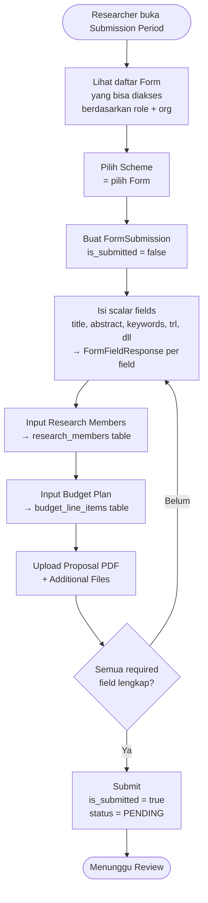
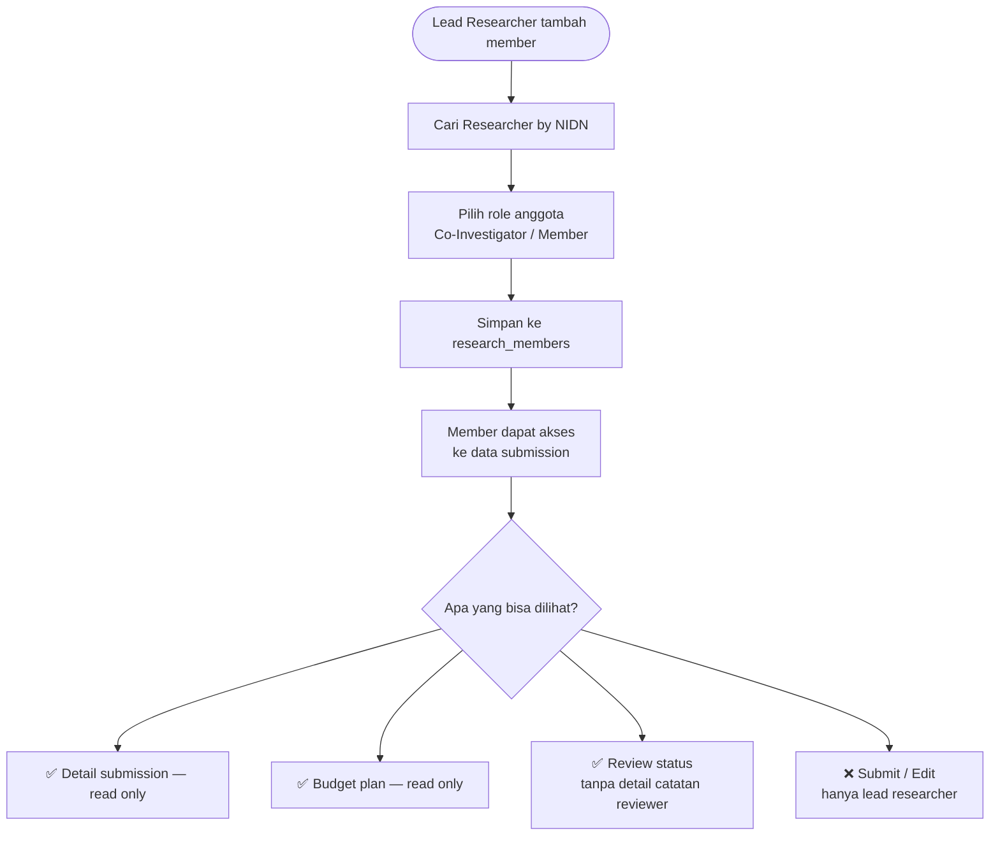
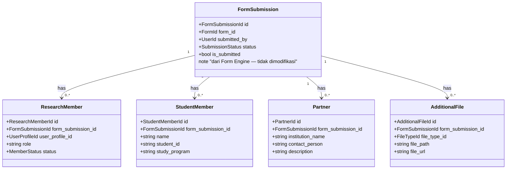

# BC: Submission

**Klasifikasi:** 🔴 Core Domain  
**Versi:** 2.0  
**Status:** Draft

---

## Responsibility

Mengelola lifecycle pengajuan proposal penelitian/pengabdian SIMPAS. Tidak punya tabel `submissions` sendiri — menggunakan `FormSubmission` dari Form Engine sebagai basis, diperluas dengan extension tables yang menyimpan data domain-spesifik.

**Prinsip:** `form_field_responses` hanya untuk scalar fields (title, abstract, dll). Semua data terstruktur (members, budget) masuk extension tables.

---

## Activity Diagram

### Alur Pembuatan Submission

### Member Visibility & Permission

---

## Aggregates

---

## ⚠️ Feature Gap — Belum Ada di Fork

| Fitur | Status | Yang Harus Dibuat |
|---|---|---|
| Research Member input | ❌ Belum ada | Tabel `research_members`, UI member picker, permission visibility |
| Budget Plan input | ❌ Belum ada | Tabel `budget_line_items`, dynamic table UI, auto-calculate total |
| Partner input | ❌ Belum ada | Tabel `submission_partners`, UI |
| Scheme integration | ❌ Belum ada | Tabel `schemes` extends Form, cascading select period → scheme → TRL |
| `parent_submission_id` | ❌ Belum ada | Kolom di `form_submissions` |

---

## Business Rules

| Kode | Rule |
|---|---|
| BR-SM-01 | Researcher hanya bisa punya satu active Submission per SubmissionPeriod per Scheme |
| BR-SM-02 | Submission hanya bisa di-submit jika FormSubmission.form.scheme.max_members terpenuhi |
| BR-SM-03 | Proposal PDF wajib ada sebelum submit |
| BR-SM-04 | ResearchMember tidak boleh jadi lead researcher di Submission lain dalam period yang sama |
| BR-SM-05 | Submission berstatus APPROVED atau REJECTED tidak bisa diubah |
| BR-SM-06 | Hanya lead researcher (`submitted_by`) yang bisa submit dan resubmit |
| BR-SM-07 | Total budget di `budget_line_items` harus ≤ `schemes.max_budget` |

---

## Domain Events

| Event | Trigger | Consumer |
|---|---|---|
| `ProposalSubmitted` | `is_submitted = true` | Review, Notification |
| `ProposalResubmitted` | Resubmit setelah revisi | Review, Notification |
| `ProposalApproved` | `status → APPROVED` | Budget (lock), Monev (eligibility), Notification |
| `ProposalRejected` | `status → REJECTED` | Notification |

---

## Integration Map

| Context | Arah | Keterangan |
|---|---|---|
| Form Engine | Upstream → Submission | FormSubmission sebagai basis |
| Scheme | Upstream → Submission | Aturan max_budget, max_members |
| Identity & Access | Upstream → Submission | UserProfileId untuk lead + members |
| File Management | Upstream → Submission | Upload proposal + additional files |
| Budget | Submission → Downstream | Extension table FK ke form_submission_id |
| Review | Submission → Downstream | Event ProposalSubmitted memicu review |
