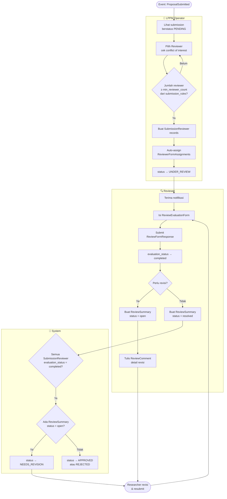
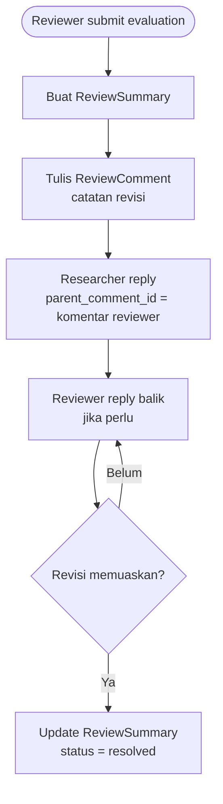
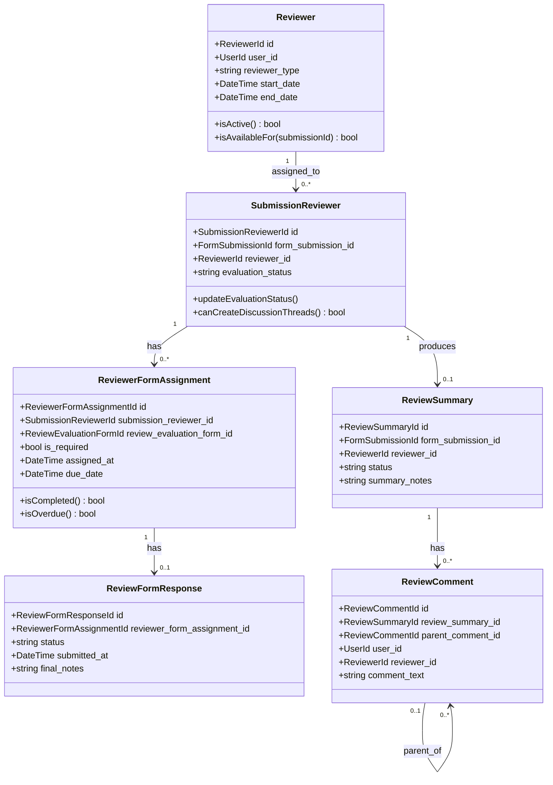

# BC: Review

**Klasifikasi:** 🔴 Core Domain  
**Versi:** 2.1  
**Status:** Draft

---

## Responsibility

Mengelola penugasan reviewer, evaluasi kuantitatif, dan diskusi revisi. Tidak ada tabel `ReviewerRole` — role reviewer dikelola sepenuhnya via Spatie Permission (`reviewer_internal`, `reviewer_external`). Jumlah minimum reviewer dikonfigurasi via `submission_rules`, bukan hardcoded.

---

## Activity Diagram

### Alur Assignment & Evaluasi



### Threaded Discussion



---

## Reviewer Roles via Spatie

Tidak ada tabel `reviewer_roles`. Perbedaan internal vs eksternal dikelola via dua Spatie roles:

| Spatie Role | Permission | Keterangan |
|---|---|---|
| `reviewer_internal` | `reviewers.evaluate`, `submissions.view-assigned`, `review.view-other-scores` | Bisa lihat skor reviewer lain setelah selesai |
| `reviewer_external` | `reviewers.evaluate`, `submissions.view-assigned` | Tidak bisa lihat skor reviewer lain |

`FormAccessControl` bisa reference salah satu role — memungkinkan form evaluasi yang berbeda untuk reviewer internal vs eksternal.

Tabel `reviewers` menyimpan `reviewer_type varchar` (`internal`/`external`) untuk keperluan display dan reporting, tanpa FK ke tabel lain:

```sql
reviewers
  id
  user_id           FK → users
  reviewer_type     varchar   -- 'internal' | 'external'
  start_date        datetime
  end_date          datetime nullable
```

---

## Configurable Min Reviewer

Tidak hardcoded. Diambil dari `submission_rules` yang sudah ada di schema sim-kerjasama:

```sql
-- submission_rules linked ke SubmissionPeriod
label = 'min_reviewer_count', value = 2
```

Admin ubah value-nya di admin panel, langsung berlaku untuk period tersebut. Berbeda period bisa punya min_reviewer berbeda.

---

## Aggregates



---

## Business Rules

| Kode | Rule |
|---|---|
| BR-REV-01 | Jumlah reviewer yang di-assign harus ≥ `submission_rules.min_reviewer_count` untuk period tersebut |
| BR-REV-02 | Reviewer tidak bisa di-assign ke submission yang ia menjadi `submitted_by` atau `ResearchMember`-nya |
| BR-REV-03 | Reviewer yang sama tidak bisa di-assign dua kali ke submission yang sama |
| BR-REV-04 | Reviewer hanya bisa membuat ReviewSummary setelah `evaluation_status = completed` atau `not_required` |
| BR-REV-05 | Submission bisa di-approve hanya jika semua SubmissionReviewer `evaluation_status = completed` DAN tidak ada ReviewSummary berstatus `open` |
| BR-REV-06 | ReviewFormResponse tidak bisa diedit setelah `status = submitted` |
| BR-REV-07 | Reviewer `reviewer_internal` bisa lihat skor reviewer lain setelah semua selesai — `reviewer_external` tidak bisa |

---

## Domain Events

| Event | Trigger | Consumer |
|---|---|---|
| `ReviewerAssigned` | Operator assign reviewer | Notification |
| `EvaluationSubmitted` | Reviewer submit ReviewFormResponse | (internal: cek semua done) |
| `RevisionRequested` | ReviewSummary dibuat status open | Submission (status → NEEDS_REVISION), Notification |
| `RevisionResolved` | ReviewSummary → resolved | (internal: cek semua resolved) |
| `ProposalApprovedByReview` | Semua reviewer done + semua resolved | Submission (status → APPROVED) |
| `ProposalRejectedByReview` | Keputusan penolakan | Submission (status → REJECTED) |
