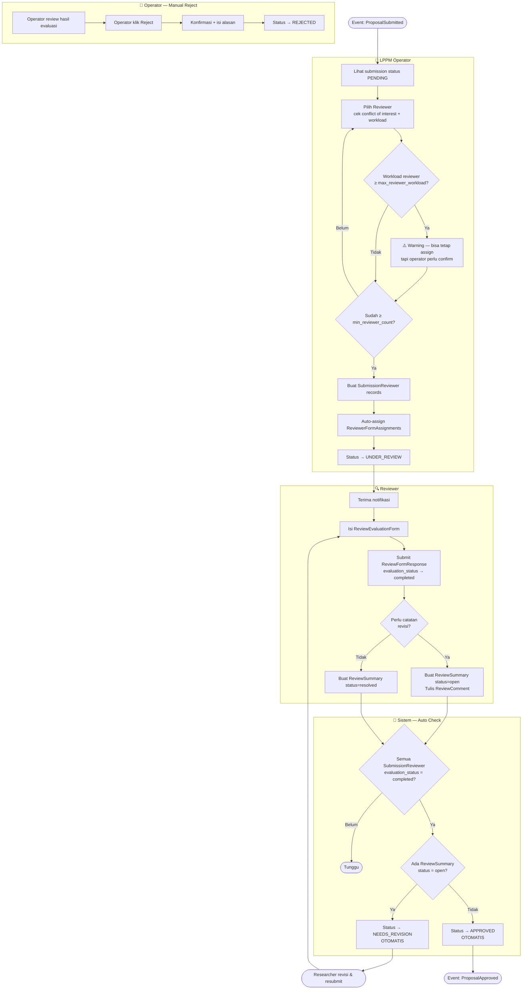
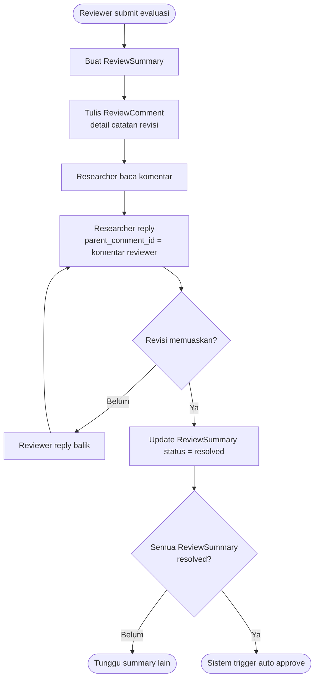
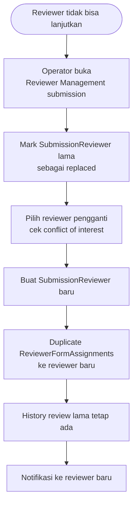
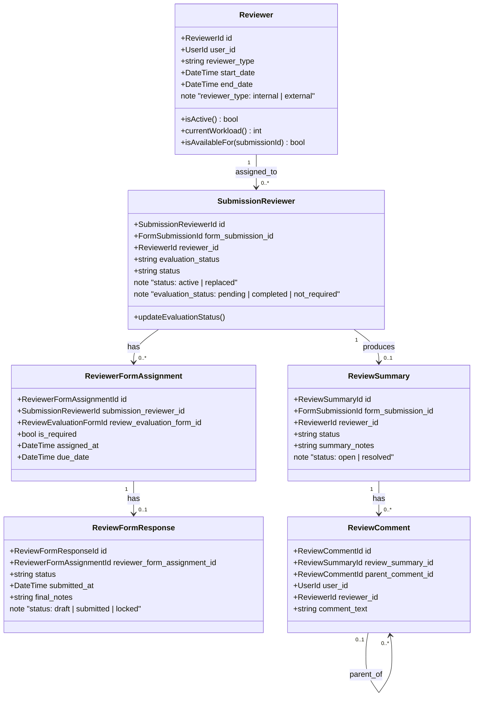

# BC: Review

**Klasifikasi:** 🔴 Core Domain  
**Versi:** 2.3  
**Status:** Draft

---

## Responsibility

Mengelola penugasan reviewer, evaluasi kuantitatif, dan diskusi revisi. Approval terjadi **otomatis** oleh sistem ketika kondisi terpenuhi. Rejection adalah satu-satunya transisi yang membutuhkan konfirmasi manual operator — karena berimplikasi besar bagi researcher dan butuh pertimbangan.

---

## Activity Diagram

### Alur Assignment & Evaluasi

### Alur Threaded Discussion (Revisi)

### Reviewer Reassignment

---

## Aggregates

---

## Reviewer Roles via Spatie

Tidak ada tabel `reviewer_roles`. Perbedaan dikelola via dua Spatie roles:

| Spatie Role         | Permissions                                                                   | Keterangan                                          |
| ------------------- | ----------------------------------------------------------------------------- | --------------------------------------------------- |
| `reviewer_internal` | `reviewers.evaluate`, `submissions.view-assigned`, `review.view-other-scores` | Bisa lihat skor reviewer lain setelah semua selesai |
| `reviewer_external` | `reviewers.evaluate`, `submissions.view-assigned`                             | Tidak bisa lihat skor reviewer lain                 |

Tabel `reviewers` menyimpan `reviewer_type varchar` (`internal` / `external`) untuk display dan reporting.

---

## Business Rules

| Kode      | Rule                                                                                                                                                          |
| --------- | ------------------------------------------------------------------------------------------------------------------------------------------------------------- |
| BR-REV-01 | Jumlah reviewer yang di-assign harus ≥ `scheme.rules.min_reviewer_count`                                                                                      |
| BR-REV-02 | Reviewer tidak bisa di-assign ke submission yang ia menjadi `submitted_by` atau `ResearchMember`-nya (mutual block — juga berlaku sebaliknya saat add member) |
| BR-REV-03 | Reviewer yang sama tidak bisa di-assign dua kali ke submission yang sama dalam satu siklus                                                                    |
| BR-REV-04 | Jika workload reviewer melebihi `scheme.rules.max_reviewer_workload`, operator mendapat warning — bukan hard block                                            |
| BR-REV-05 | Submission di-approve **otomatis** jika: semua `evaluation_status = completed` DAN tidak ada ReviewSummary `open`                                             |
| BR-REV-06 | Submission masuk NEEDS_REVISION **otomatis** jika: semua `evaluation_status = completed` DAN ada ReviewSummary `open`                                         |
| BR-REV-07 | Rejection harus dikonfirmasi manual oleh Operator — tidak bisa otomatis                                                                                       |
| BR-REV-08 | ReviewFormResponse tidak bisa diedit setelah `status = submitted`                                                                                             |
| BR-REV-09 | Reviewer hanya aktif selama rentang `start_date` hingga `end_date`                                                                                            |
| BR-REV-10 | Saat reviewer diganti (reassignment), SubmissionReviewer lama di-mark `replaced` — tidak dihapus                                                              |
| BR-REV-11 | `reviewer_internal` bisa lihat skor reviewer lain setelah semua selesai — `reviewer_external` tidak bisa                                                      |
| BR-REV-12 | Researcher hanya bisa lihat skor evaluasi reviewer setelah submission berstatus APPROVED atau REJECTED — tidak selama proses review berlangsung               |

---

## Domain Events

| Event                      | Trigger                                                | Consumer                        |
| -------------------------- | ------------------------------------------------------ | ------------------------------- |
| `ReviewerAssigned`         | Operator assign reviewer                               | Notification                    |
| `EvaluationSubmitted`      | Reviewer submit ReviewFormResponse                     | (internal: trigger auto check)  |
| `RevisionRequested`        | ReviewSummary dibuat status open → auto NEEDS_REVISION | Submission, Notification        |
| `RevisionResolved`         | ReviewSummary → resolved → trigger auto check          | (internal)                      |
| `ProposalApprovedByReview` | Kondisi auto approve terpenuhi                         | Submission (status → APPROVED)  |
| `ProposalRejectedByReview` | Operator konfirmasi reject                             | Submission (status → REJECTED)  |
| `ReviewerReassigned`       | Operator ganti reviewer                                | Notification, Reporting (audit) |

---

## Integration Map

| Context           | Arah                | Keterangan                                         |
| ----------------- | ------------------- | -------------------------------------------------- |
| Form Engine       | Upstream → Review   | ReviewEvaluationForm, ReviewSummary, ReviewComment |
| Submission        | Upstream → Review   | Consume ProposalSubmitted                          |
| Identity & Access | Upstream → Review   | UserProfileId untuk conflict of interest check     |
| Submission        | Review → Downstream | Publish approved/rejected event ke Submission      |
| Reporting         | Review → Read       | Data evaluasi untuk statistik dan export           |
