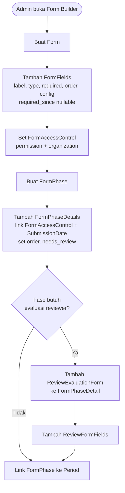
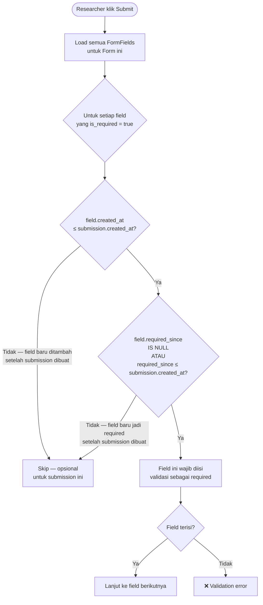
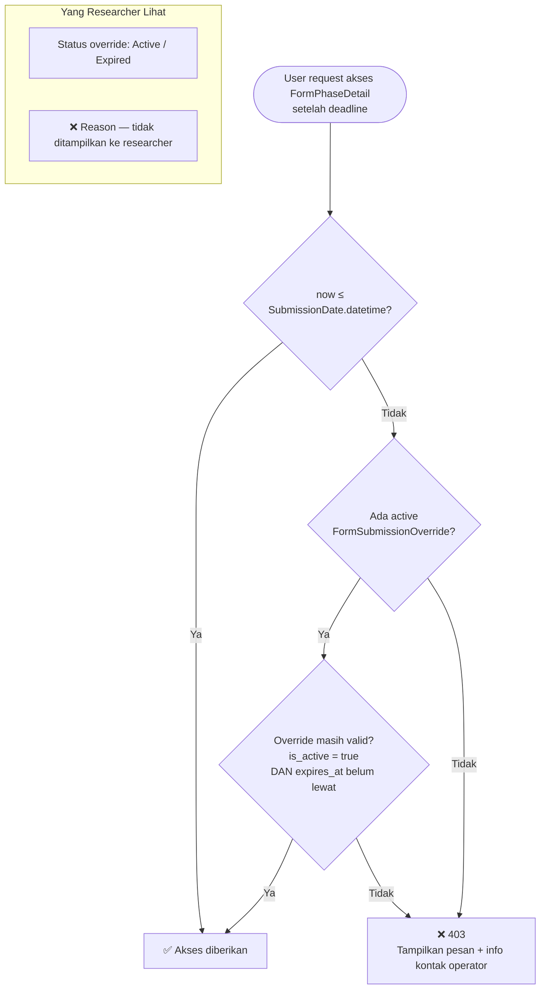
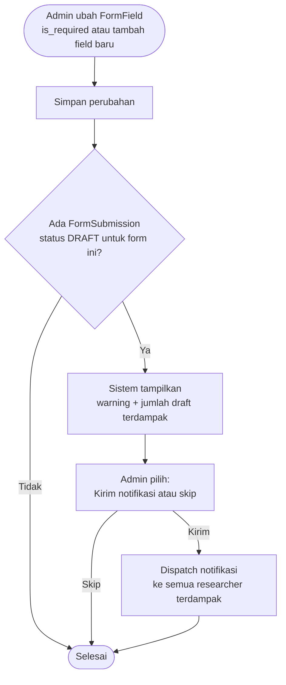
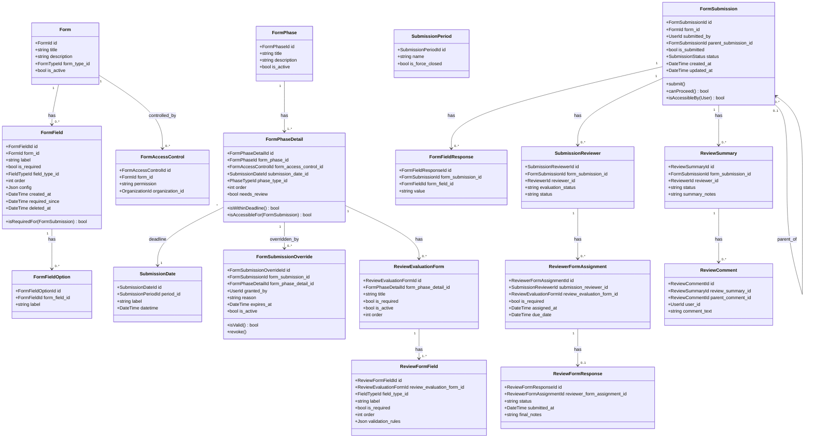

# BC: Form Engine

**Klasifikasi:** 🟢 Generic Domain  
**Versi:** 2.3  
**Status:** Draft

---

## Responsibility

Platform inti yang diwarisi dari sim-kerjasama-itk. Generik dan bisa dipakai untuk sistem apapun — tidak ada business logic SIMPAS di sini. Semua BC lain dibangun di atas Form Engine.

---

## Activity Diagram

### Alur Konfigurasi Form



### Temporal Field Binding — Alur Validasi Submit



### Alur Override Deadline



### Alur Perubahan Form dengan Active Drafts



---

## Aggregates



---

## Temporal Field Binding

Logika validasi field saat submit:

```php
public function isRequiredFor(FormSubmission $submission): bool
{
    // Field harus sudah ada sebelum submission dibuat
    if ($this->created_at > $submission->created_at) {
        return false;
    }

    // Field harus sudah required sebelum submission dibuat
    if ($this->required_since !== null && $this->required_since > $submission->created_at) {
        return false;
    }

    return $this->is_required;
}
```

Ketika operator mengubah `is_required` dari false ke true, sistem otomatis set `required_since = now()`. Ketika field dibuat dengan `is_required = true`, `required_since` diset sama dengan `created_at`.

---

## FormSubmissionOverride — Visibility ke Researcher

Researcher bisa melihat **status** override (aktif atau sudah expired) di UI — tampil sebagai badge "Akses Diperpanjang oleh Operator". Researcher **tidak bisa melihat** `reason` — itu hanya untuk Operator dan Admin.

---

## Optimistic Locking

Semua save operation menyertakan `updated_at` check:

```php
// Di controller sebelum save
$submission = FormSubmission::lockForUpdate()->find($id);
if ($submission->updated_at->ne($request->last_updated_at)) {
    return response()->json([
        'message' => 'Data sudah diubah oleh pengguna lain. Muat ulang halaman.'
    ], 409);
}
```

---

## Business Rules

| Kode     | Rule                                                                                                                      |
| -------- | ------------------------------------------------------------------------------------------------------------------------- |
| BR-FE-01 | FormSubmission hanya bisa dibuat selama SubmissionPeriod aktif dan tidak `is_force_closed`                                |
| BR-FE-02 | User hanya bisa akses Form jika ada FormAccessControl yang match permission user DAN org subtree user                     |
| BR-FE-03 | FormFieldResponse hanya menyimpan scalar values                                                                           |
| BR-FE-04 | Child FormSubmission hanya bisa dibuat jika parent sudah APPROVED                                                         |
| BR-FE-05 | ReviewFormResponse tidak bisa diedit setelah `status = submitted`                                                         |
| BR-FE-06 | Reviewer hanya bisa membuat ReviewSummary setelah `evaluation_status = completed` atau `not_required`                     |
| BR-FE-07 | FormPhaseDetail.submission_date_id NOT NULL — setiap detail wajib punya deadline                                          |
| BR-FE-08 | Akses ke FormPhaseDetail di-hard-block jika deadline lewat dan tidak ada active FormSubmissionOverride                    |
| BR-FE-09 | FormSubmissionOverride.reason wajib diisi — tidak boleh kosong                                                            |
| BR-FE-10 | Override hanya berlaku untuk satu form_submission_id + satu form_phase_detail_id                                          |
| BR-FE-11 | Field hanya di-enforce is_required jika `created_at ≤ submission.created_at` DAN `required_since ≤ submission.created_at` |
| BR-FE-12 | FormField menggunakan soft delete (`deleted_at`) — tidak boleh hard delete                                                |
| BR-FE-13 | Saat operator ubah Form yang punya active drafts, sistem prompt untuk kirim notifikasi ke researcher terdampak            |
| BR-FE-14 | Concurrent edit dicegah via optimistic locking — `updated_at` di request harus match dengan yang di DB                    |
| BR-FE-15 | Expired FormPhaseDetail tetap tampil di UI sebagai read-only — user bisa lihat apa yang sudah disubmit                    |

---

## Integration Map

| Context           | Arah                     | Keterangan                                                   |
| ----------------- | ------------------------ | ------------------------------------------------------------ |
| Submission        | Form Engine → Downstream | FormSubmission sebagai basis Submission SIMPAS               |
| Review            | Form Engine → Downstream | ReviewEvaluationForm, ReviewSummary, ReviewComment           |
| Monev             | Form Engine → Downstream | FormPhase untuk monev stages, child FormSubmission           |
| Identity & Access | Upstream → Form Engine   | Permission string dan OrganizationId untuk FormAccessControl |
