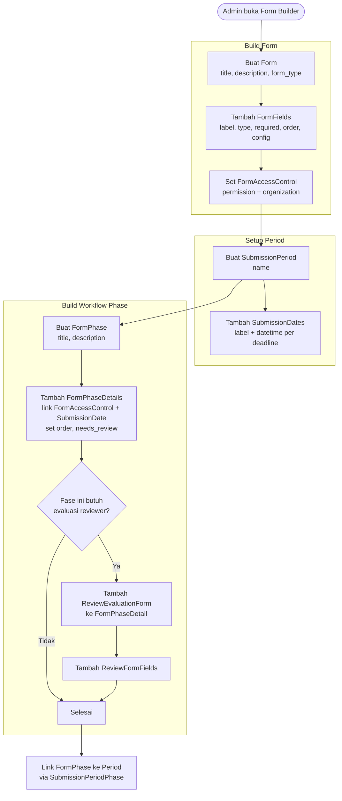
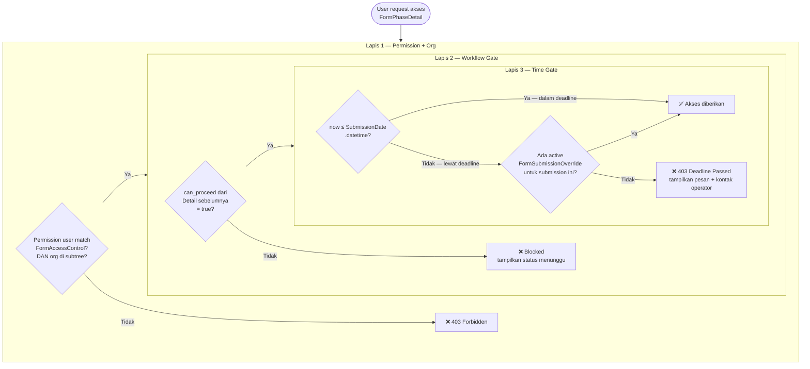
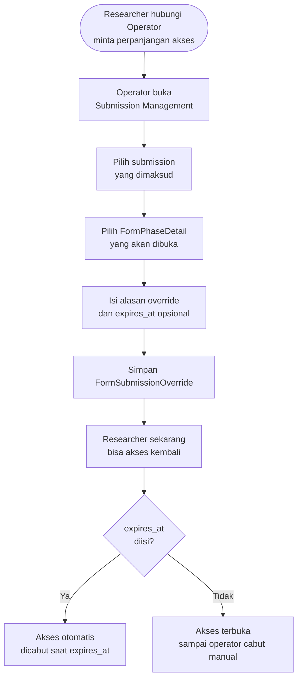
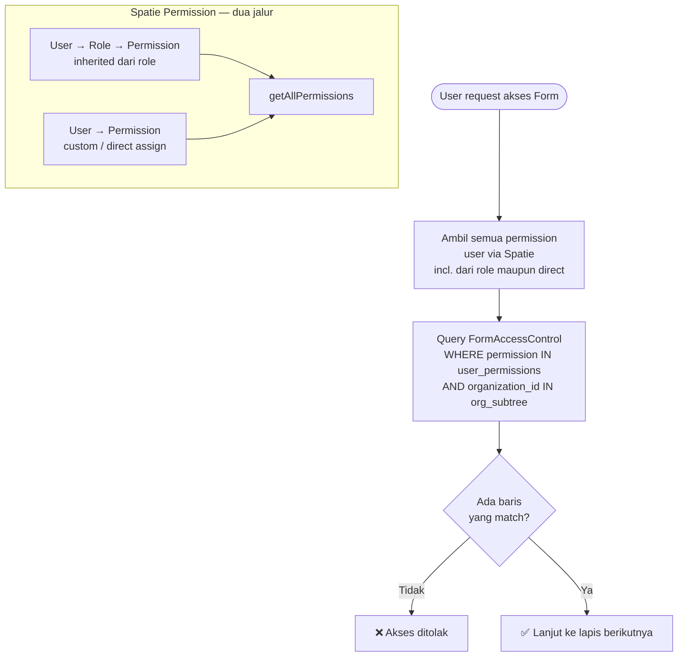
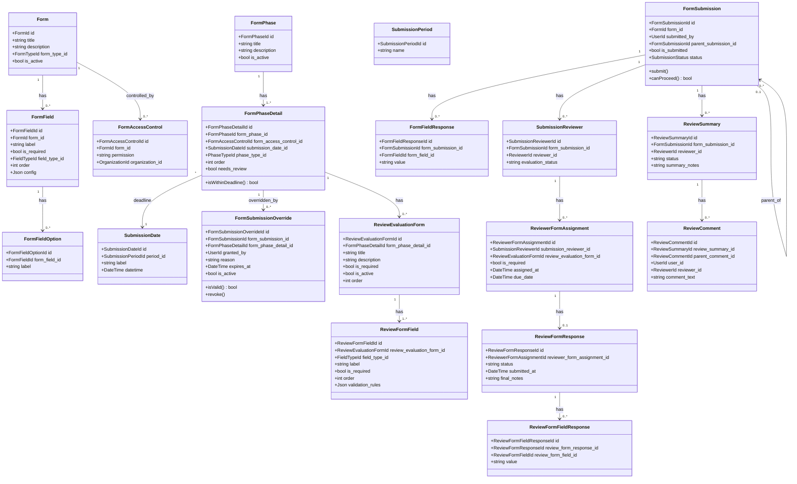

# BC: Form Engine

**Klasifikasi:** 🟢 Generic Domain  
**Versi:** 2.2  
**Status:** Draft

---

## Responsibility

Platform inti yang diwarisi dari sim-kerjasama-itk. Menyediakan infrastruktur untuk mendefinisikan form, mengatur workflow berbasis fase, mengontrol akses, dan menyimpan respons. Semua bounded context lain **dibangun di atas** Form Engine — bukan menggantikannya.

Tidak ada business logic SIMPAS di sini. Form Engine generik dan bisa dipakai untuk sistem apapun.

---

## Activity Diagram

### Alur Konfigurasi (Admin/Operator)



### Alur Submit FormSubmission


### Alur Temporal Access Check

Setiap kali user mencoba mengakses atau mengedit sebuah FormPhaseDetail, tiga kondisi ini dicek secara berurutan.



### Alur Override oleh Operator



### Alur Access Check (Permission)



---

## Aggregates



---

## Konsep `FormPhaseDetail.submission_date_id` — Hard Deadline

Setiap `FormPhaseDetail` wajib punya satu `SubmissionDate` sebagai deadline (NOT NULL). Operator set deadline ini saat konfigurasi phase — tidak ada detail tanpa batas waktu.

Satu `SubmissionDate` bisa di-reference oleh banyak `FormPhaseDetail`. Misalnya "Batas Submit Pengajuan" bisa jadi deadline untuk form pengajuan utama sekaligus form upload berkas pendukung.

Setelah `SubmissionDate.datetime` terlewat, akses ke detail tersebut ditutup secara hard — tidak ada pesan warning yang bisa di-bypass. Satu-satunya jalan adalah `FormSubmissionOverride` dari operator.

---

## Konsep `FormSubmissionOverride` — Bypass Deadline

Override dibuat oleh operator untuk satu submission + satu FormPhaseDetail secara spesifik. Tidak mempengaruhi submission lain atau period secara keseluruhan.

```sql
form_submission_overrides
  id
  form_submission_id    FK → form_submissions
  form_phase_detail_id  FK → form_phase_details
  granted_by            FK → users
  reason                text        -- wajib diisi operator
  expires_at            timestamp nullable  -- null = tidak ada batas baru
  is_active             boolean default true
  created_at, updated_at
```

`is_active` bisa diset `false` oleh operator untuk mencabut override sebelum `expires_at`. Semua override tercatat permanen di tabel untuk keperluan audit trail.

---

## Konsep `FormAccessControl` — Permission + Org

`form_access_controls` menyimpan `permission` (string) + `organization_id`. Dua jalur Spatie ter-cover oleh satu query:

```php
$userPermissions = $user->getAllPermissions()->pluck('name');
$userOrgSubtree  = Organization::subtreeIds($user->profile->organization_id);

$canAccess = FormAccessControl::where('form_id', $form->id)
    ->whereIn('permission', $userPermissions)
    ->whereIn('organization_id', $userOrgSubtree)
    ->exists();
```

---

## Konsep `parent_submission_id`

`FormSubmission` bisa punya hierarki. Parent selalu submission pengajuan utama. Child submissions digunakan untuk:

| Child Type      | Digunakan untuk          | Siapa yang isi |
| --------------- | ------------------------ | -------------- |
| Progress Report | Laporan kemajuan monev   | Researcher     |
| Kelengkapan     | Upload dokumen pendukung | Researcher     |
| Research Output | Pelaporan luaran         | Researcher     |

---

## Konsep `RepeatableField`

`FormField` dengan `field_type = 'repeatable'` dan `config` berisi JSON schema sub-fields. **Config adalah UI schema saja** — data dikirim ke extension table, bukan ke `form_field_responses`.

```json
{
    "add_label": "Tambah Anggota",
    "min_entries": 0,
    "max_entries": 5,
    "fields": [
        { "key": "nidn", "label": "NIDN", "type": "text", "required": true },
        {
            "key": "name",
            "label": "Nama Lengkap",
            "type": "text",
            "required": true
        },
        { "key": "role", "label": "Peran", "type": "select", "required": true }
    ]
}
```

---

## Business Rules

| Kode     | Rule                                                                                                                                |
| -------- | ----------------------------------------------------------------------------------------------------------------------------------- |
| BR-FE-01 | `FormSubmission` hanya bisa dibuat selama `SubmissionPeriod` masih aktif                                                            |
| BR-FE-02 | User hanya bisa akses Form jika ada `FormAccessControl` yang match permission user DAN organization subtree user                    |
| BR-FE-03 | `FormFieldResponse` hanya menyimpan scalar values — tidak ada array atau object                                                     |
| BR-FE-04 | Child `FormSubmission` hanya bisa dibuat jika parent sudah berstatus `APPROVED`                                                     |
| BR-FE-05 | `ReviewFormResponse` tidak bisa diedit setelah `status = submitted`                                                                 |
| BR-FE-06 | Reviewer hanya bisa membuat `ReviewSummary` setelah `evaluation_status = completed` atau `not_required`                             |
| BR-FE-07 | `FormPhaseDetail.submission_date_id` NOT NULL — setiap detail wajib punya deadline                                                  |
| BR-FE-08 | Akses ke `FormPhaseDetail` ditolak secara hard jika `now() > SubmissionDate.datetime` dan tidak ada active `FormSubmissionOverride` |
| BR-FE-09 | `FormSubmissionOverride.reason` wajib diisi — tidak boleh kosong                                                                    |
| BR-FE-10 | Override hanya berlaku untuk satu `form_submission_id` + satu `form_phase_detail_id` — tidak bisa bulk override                     |
| BR-FE-11 | `SubmissionDate` yang sama boleh di-reference oleh banyak `FormPhaseDetail` dalam phase yang sama                                   |

---

## Integration Map

| Context           | Arah                     | Keterangan                                                   |
| ----------------- | ------------------------ | ------------------------------------------------------------ |
| Submission        | Form Engine → Downstream | FormSubmission adalah basis Submission SIMPAS                |
| Review            | Form Engine → Downstream | ReviewEvaluationForm, ReviewSummary, ReviewComment           |
| Monev             | Form Engine → Downstream | FormPhase untuk monev stages, child FormSubmission           |
| Research Output   | Form Engine → Downstream | Child FormSubmission untuk output reporting                  |
| Identity & Access | Upstream → Form Engine   | Permission string dan OrganizationId untuk FormAccessControl |
