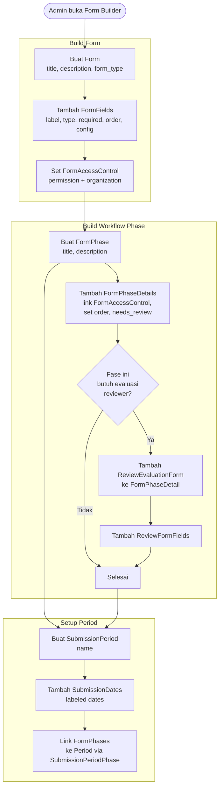
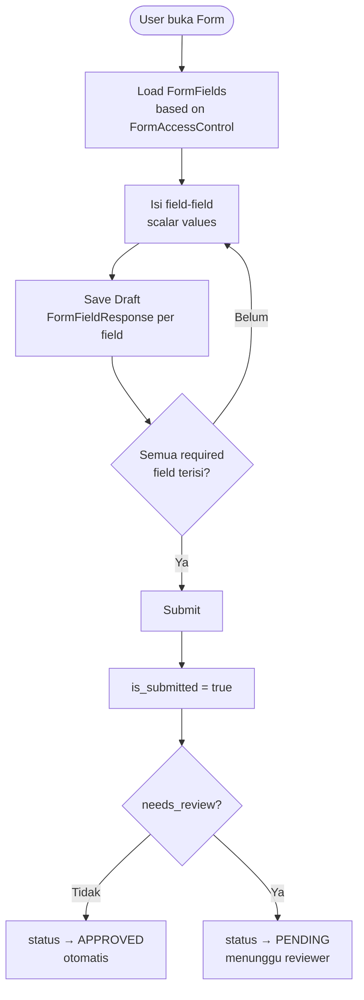
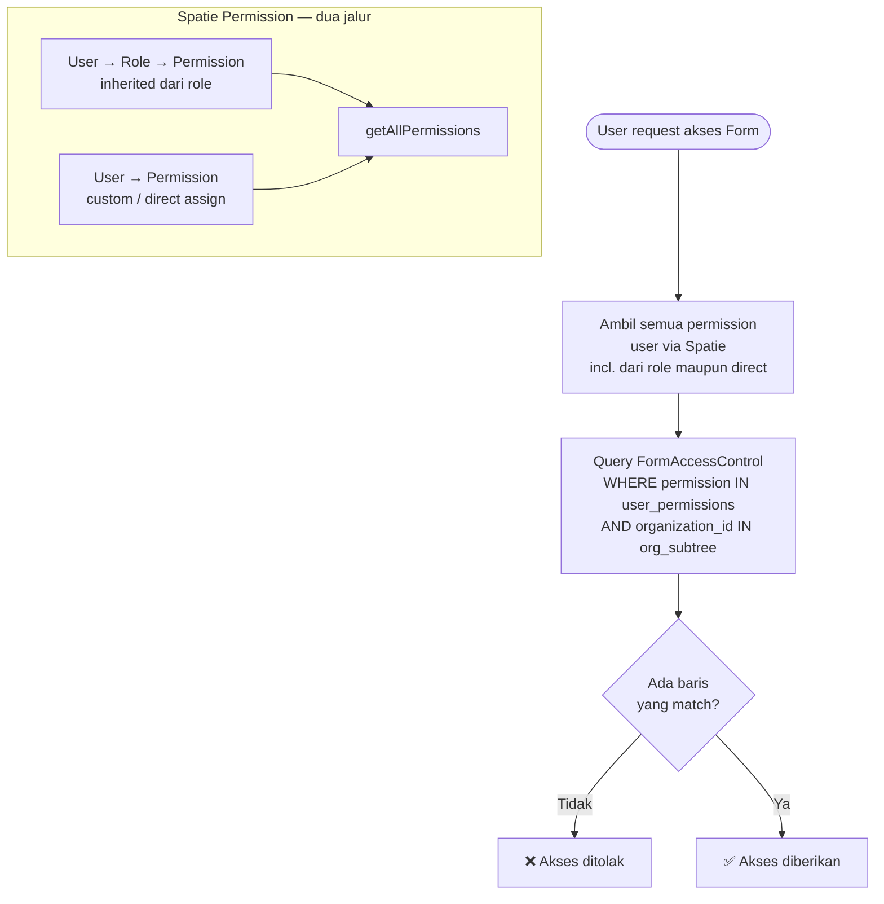
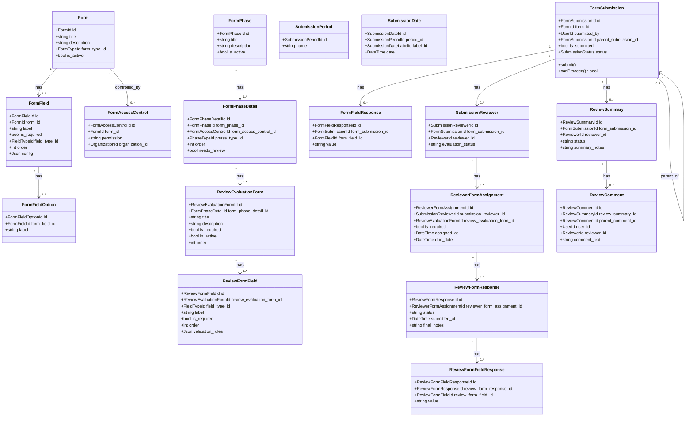

# BC: Form Engine

**Klasifikasi:** 🟢 Generic Domain  
**Versi:** 2.1  
**Status:** Draft

---

## Responsibility

Platform inti yang diwarisi dari sim-kerjasama-itk. Menyediakan infrastruktur untuk mendefinisikan form, mengatur workflow berbasis fase, mengontrol akses, dan menyimpan respons. Semua bounded context lain **dibangun di atas** Form Engine — bukan menggantikannya.

Tidak ada business logic SIMPAS di sini. Form Engine generik dan bisa dipakai untuk sistem apapun.

---

## Activity Diagram

### Alur Konfigurasi (Admin/Operator)



### Alur Submit FormSubmission



### Alur Access Check



---

## Aggregates



---

## Konsep `FormAccessControl` — Permission + Org

`form_access_controls` tidak lagi menyimpan `role_id`. Yang disimpan adalah **nama permission** (string) dan `organization_id`. Ini memungkinkan dua jalur akses via Spatie yang transparan:

```
User → Role → Permission   (inherited — majority of users)
User → Permission           (direct / custom — edge cases)
```

Keduanya ter-cover oleh satu query yang sama:

```php
$userPermissions = $user->getAllPermissions()->pluck('name');
$userOrgSubtree  = Organization::subtreeIds($user->profile->organization_id);

$canAccess = FormAccessControl::where('form_id', $form->id)
    ->whereIn('permission', $userPermissions)
    ->whereIn('organization_id', $userOrgSubtree)
    ->exists();
```

Operator tidak perlu tahu apakah permission user berasal dari role atau direct assign — access check-nya identik.

---

## Konsep `parent_submission_id`

`FormSubmission` bisa punya hierarki. Parent selalu submission pengajuan utama. Child submissions digunakan untuk:

| Child Type      | Digunakan untuk          | Siapa yang isi |
| --------------- | ------------------------ | -------------- |
| Progress Report | Laporan kemajuan monev   | Researcher     |
| Kelengkapan     | Upload dokumen pendukung | Researcher     |
| Research Output | Pelaporan luaran         | Researcher     |

Satu parent bisa punya banyak child dari tipe yang sama (e.g., banyak laporan per siklus monev).

---

## Konsep `RepeatableField`

`FormField` dengan `field_type = 'repeatable'` dan kolom `config` berisi JSON schema sub-fields:

```json
{
    "add_label": "Tambah Anggota",
    "min_entries": 0,
    "max_entries": 5,
    "fields": [
        { "key": "nidn", "label": "NIDN", "type": "text", "required": true },
        {
            "key": "name",
            "label": "Nama Lengkap",
            "type": "text",
            "required": true
        },
        { "key": "role", "label": "Peran", "type": "select", "required": true }
    ]
}
```

**Penting:** `config` adalah **UI schema saja**. Data tidak masuk ke `form_field_responses`. Saat submit, frontend kirim data repeatable ke endpoint extension table yang sesuai (research_members, budget_line_items, dll).

---

## Business Rules

| Kode     | Rule                                                                                                             |
| -------- | ---------------------------------------------------------------------------------------------------------------- |
| BR-FE-01 | `FormSubmission` hanya bisa dibuat selama `SubmissionPeriod` masih aktif                                         |
| BR-FE-02 | User hanya bisa akses Form jika ada `FormAccessControl` yang match permission user DAN organization subtree user |
| BR-FE-03 | `FormFieldResponse` hanya menyimpan scalar values — tidak ada array atau object                                  |
| BR-FE-04 | Child `FormSubmission` hanya bisa dibuat jika parent sudah berstatus `APPROVED`                                  |
| BR-FE-05 | `ReviewFormResponse` tidak bisa diedit setelah `status = submitted`                                              |
| BR-FE-06 | Reviewer hanya bisa membuat `ReviewSummary` setelah `evaluation_status = completed` atau `not_required`          |

---

## Integration Map

| Context           | Arah                     | Keterangan                                                   |
| ----------------- | ------------------------ | ------------------------------------------------------------ |
| Submission        | Form Engine → Downstream | FormSubmission adalah basis Submission SIMPAS                |
| Review            | Form Engine → Downstream | ReviewEvaluationForm, ReviewSummary, ReviewComment           |
| Monev             | Form Engine → Downstream | FormPhase untuk monev stages, child FormSubmission           |
| Research Output   | Form Engine → Downstream | Child FormSubmission untuk output reporting                  |
| Identity & Access | Upstream → Form Engine   | Permission string dan OrganizationId untuk FormAccessControl |
