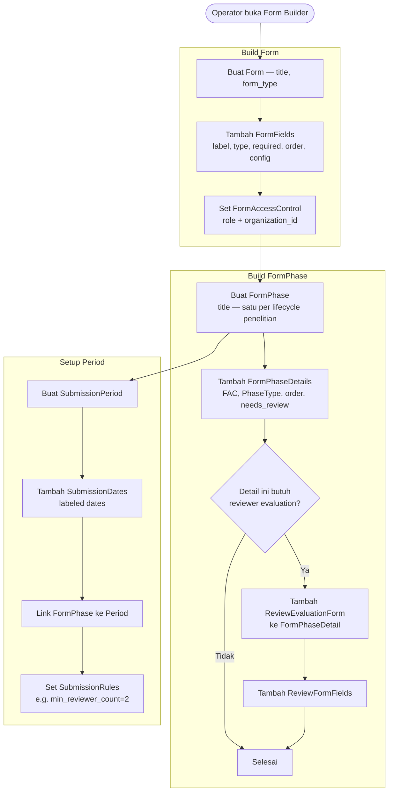
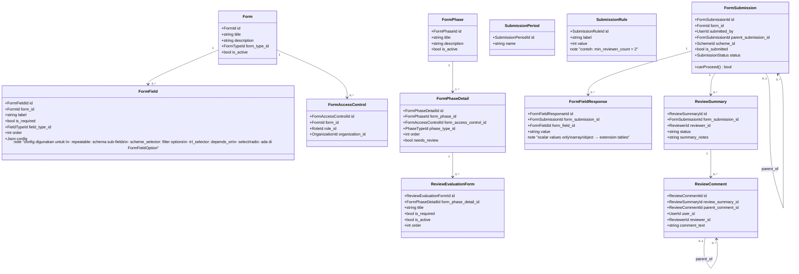

# BC: Form Engine

**Klasifikasi:** 🟢 Generic Domain  
**Versi:** 2.1  
**Status:** Draft

---

## Responsibility

Platform inti yang diwarisi dari sim-kerjasama-itk. Menyediakan infrastruktur untuk mendefinisikan form, workflow berbasis fase, access control, dan menyimpan respons. Context lain dibangun **di atas** Form Engine, tidak menggantikannya.

Tidak ada business logic SIMPAS di sini.

---

## Special Field Types

Selain field type standar (`text`, `textarea`, `select`, `radio`, `checkbox`, `file`, `date`, `number`, `url`), Form Engine support field type khusus berikut:

| Field Type        | Deskripsi                                                                                                 | Config                                              |
| ----------------- | --------------------------------------------------------------------------------------------------------- | --------------------------------------------------- |
| `repeatable`      | Field yang bisa diisi banyak entri. **Data dikirim ke extension tables, bukan form_field_responses.**     | `{ fields[], min_entries, max_entries, add_label }` |
| `scheme_selector` | Dropdown scheme yang di-load berdasarkan SubmissionPeriod aktif. Saves `scheme_id` ke `form_submissions`. | `{ filter_by_period, filter_by_submission_type }`   |
| `trl_selector`    | Dropdown TRL yang di-filter berdasarkan scheme yang dipilih.                                              | `{ depends_on: 'scheme' }`                          |

Kalau `scheme_selector` tidak ada di Form → submission tidak butuh scheme.  
Kalau `trl_selector` tidak ada di Form → submission tidak butuh TRL.  
Ini membuat Form Engine tetap general — fitur domain-specific di-inject via field config.

---

## Activity Diagram

### Konfigurasi Form & Phase (Admin/Operator)

---

## Aggregates

---

## Business Rules

| Kode     | Rule                                                                                                  |
| -------- | ----------------------------------------------------------------------------------------------------- |
| BR-FE-01 | FormSubmission hanya bisa dibuat selama SubmissionPeriod masih aktif                                  |
| BR-FE-02 | User hanya bisa submit Form yang ia punya akses via FormAccessControl (role + org subtree match)      |
| BR-FE-03 | `FormFieldResponse` hanya untuk scalar values — repeatable & structured data ke extension tables      |
| BR-FE-04 | Child FormSubmission hanya bisa dibuat jika parent sudah `APPROVED` atau `canProceed() = true`        |
| BR-FE-05 | ReviewFormResponse tidak bisa diedit setelah `status = submitted`                                     |
| BR-FE-06 | Reviewer hanya bisa membuat ReviewSummary setelah `evaluation_status = completed` atau `not_required` |
| BR-FE-07 | `scheme_id` di FormSubmission wajib diisi hanya jika Form punya field bertipe `scheme_selector`       |
