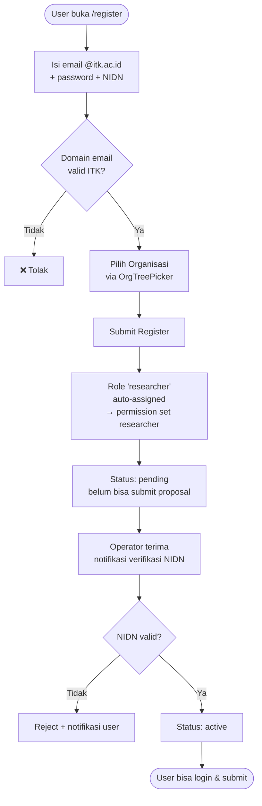
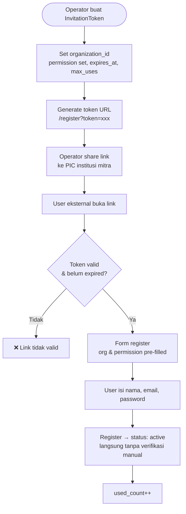
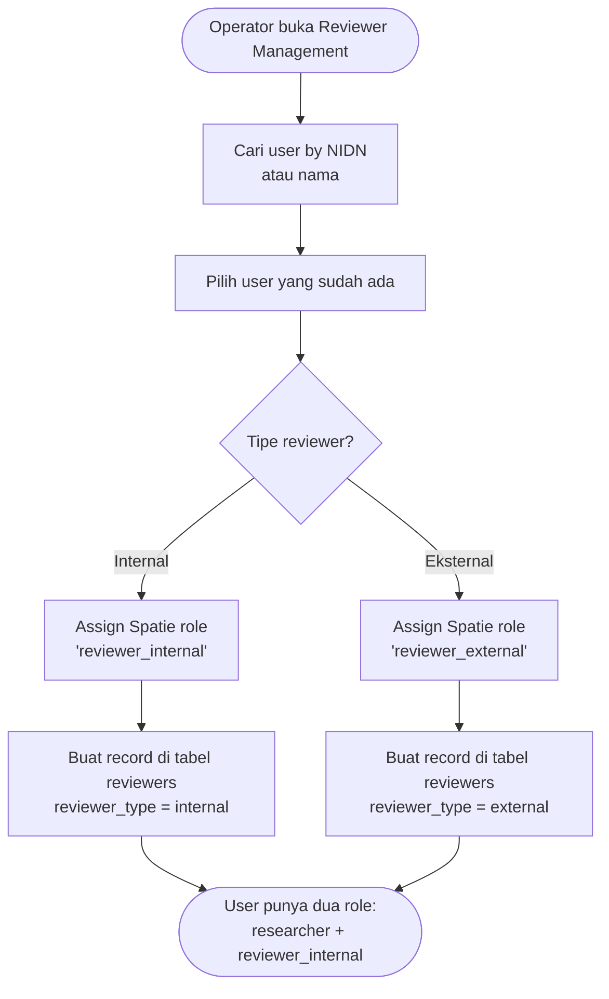
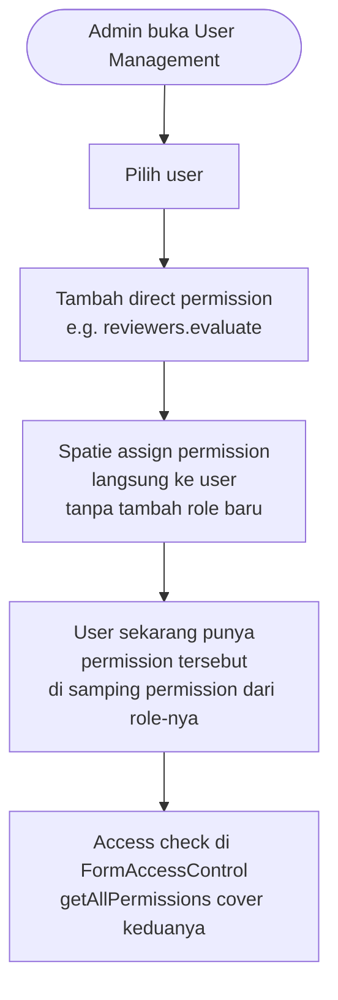
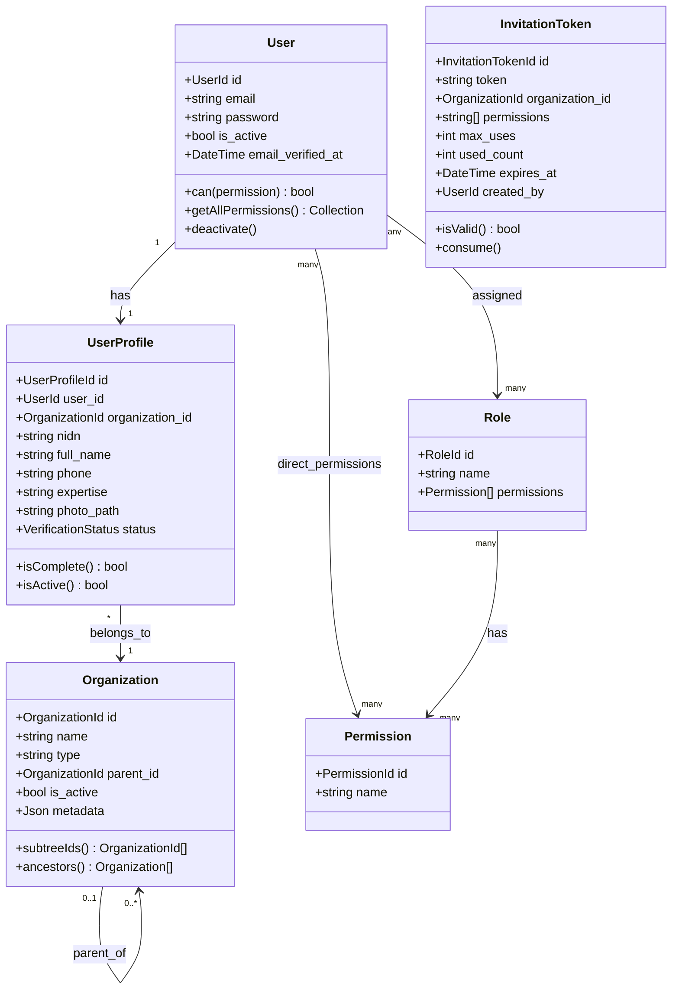

# BC: Identity & Access

**Klasifikasi:** 🟢 Generic Domain  
**Versi:** 2.1  
**Status:** Draft

---

## Responsibility

Mengelola autentikasi, profil user, hierarki organisasi, dan kontrol akses. Dua pilar utama:

- **Spatie Permission** → _apa yang boleh dilakukan_ (authorization)
- **Organization tree** → _dari mana user berasal_ (identity/scope)
  Keduanya independen. `FormAccessControl` menggunakan **permission + org** — bukan role + org — sehingga user dengan custom permission langsung (tanpa role) tetap mendapat akses yang sesuai.

---

## Activity Diagram

### Jalur 1 — Self-Register (Dosen ITK)



### Jalur 2 — Invitation Link (External)



### Jalur 3 — Reviewer (Ditunjuk Operator)



### Custom Permission untuk User Spesifik



---

## Aggregates



---

## Spatie Permission Design

**Permissions** (granular, yang di-check di kode dan di `FormAccessControl`):

```
submissions.create          submissions.view-own
submissions.view-all        budget.edit
members.manage              reviewers.assign
reviewers.evaluate          reviewers.view-scores-others
periods.manage              schemes.manage
outputs.manage              users.verify
users.manage
```

**Roles** (bundle permissions — mayoritas user):

| Role                | Permissions                                                                     |
| ------------------- | ------------------------------------------------------------------------------- |
| `researcher`        | submissions.create, view-own, budget.edit, members.manage, outputs.manage       |
| `reviewer_internal` | reviewers.evaluate, submissions.view-assigned, **reviewers.view-scores-others** |
| `reviewer_external` | reviewers.evaluate, submissions.view-assigned                                   |
| `operator`          | submissions.view-all, reviewers.assign, periods.manage, users.verify            |
| `admin`             | semua                                                                           |

**Custom permission (direct assign ke user):**

Untuk edge case — satu user tertentu butuh akses yang tidak cocok dengan role manapun. Admin assign permission langsung ke user via Spatie tanpa membuat role baru.

```php
// Assign permission langsung ke user
$user->givePermissionTo('reviewers.evaluate');

// Access check — transparan, cover role maupun direct
$user->can('reviewers.evaluate');           // true
$user->getAllPermissions()->pluck('name'); // include semua sumber
```

---

## Bagaimana Permission + Org Bekerja di FormAccessControl

`FormAccessControl` menyimpan `permission` (string) + `organization_id`. Access check:

```php
function canAccessForm(User $user, Form $form): bool
{
    $userPermissions = $user->getAllPermissions()->pluck('name');
    $userOrgSubtree  = Organization::subtreeIds(
        $user->profile->organization_id
    );

    return FormAccessControl::where('form_id', $form->id)
        ->whereIn('permission', $userPermissions)
        ->whereIn('organization_id', $userOrgSubtree)
        ->exists();
}
```

Contoh konfigurasi FormAccessControl:

| Form                  | Permission                     | Organization   | Efek                                         |
| --------------------- | ------------------------------ | -------------- | -------------------------------------------- |
| Form Pengajuan        | `submissions.create`           | ITK (root)     | Semua researcher ITK bisa akses              |
| Form Pengajuan        | `submissions.create`           | Unmul (root)   | Semua researcher Unmul bisa akses            |
| Form Evaluasi         | `reviewers.evaluate`           | ITK (root)     | Reviewer internal & eksternal ITK bisa akses |
| Form Laporan Internal | `reviewers.view-scores-others` | Fakultas Sains | Hanya reviewer_internal dari Fakultas Sains  |

---

## Business Rules

| Kode      | Rule                                                                                                                               |
| --------- | ---------------------------------------------------------------------------------------------------------------------------------- |
| BR-IAM-01 | Email domain `@itk.ac.id` wajib untuk jalur self-register internal                                                                 |
| BR-IAM-02 | NIDN harus unik di seluruh sistem                                                                                                  |
| BR-IAM-03 | UserProfile wajib lengkap sebelum user bisa membuat Submission                                                                     |
| BR-IAM-04 | User berstatus `pending` bisa login tapi tidak bisa submit proposal                                                                |
| BR-IAM-05 | Deaktivasi user tidak delete data — cukup `is_active = false`                                                                      |
| BR-IAM-06 | InvitationToken invalid jika `used_count >= max_uses` atau `expires_at` sudah lewat                                                |
| BR-IAM-07 | User dengan role `reviewer_internal` atau `reviewer_external` tidak bisa me-review submission yang ia menjadi `ResearchMember`-nya |
| BR-IAM-08 | Organization tidak bisa di-delete jika masih ada UserProfile di subtree-nya                                                        |
| BR-IAM-09 | Direct permission ke user tidak menghapus permission dari role — keduanya additive                                                 |

---

## Domain Events

| Event               | Trigger                  | Consumer     |
| ------------------- | ------------------------ | ------------ |
| `UserRegistered`    | User berhasil register   | Notification |
| `UserVerified`      | Operator verifikasi NIDN | Notification |
| `UserDeactivated`   | Admin nonaktifkan user   | Notification |
| `ReviewerAppointed` | Operator assign reviewer | Notification |

---

## Database Notes (PostgreSQL)

Recursive CTE untuk org subtree traversal:

```sql
WITH RECURSIVE org_subtree AS (
    SELECT id FROM organizations WHERE id = $1
    UNION ALL
    SELECT o.id FROM organizations o
    INNER JOIN org_subtree ot ON o.parent_id = ot.id
    WHERE o.is_active = true
)
SELECT id FROM org_subtree;
```

Untuk performa, bisa di-cache di Redis dengan TTL pendek (misalnya 5 menit) karena org tree jarang berubah.
