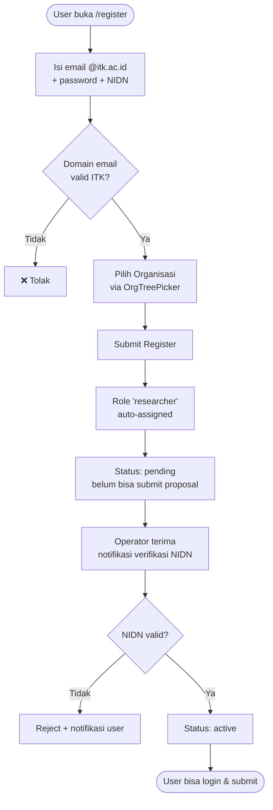
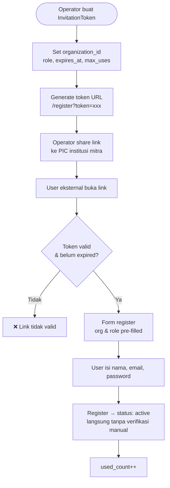
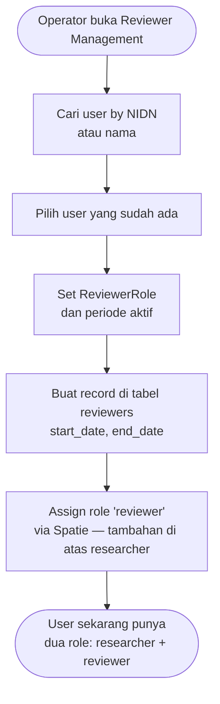
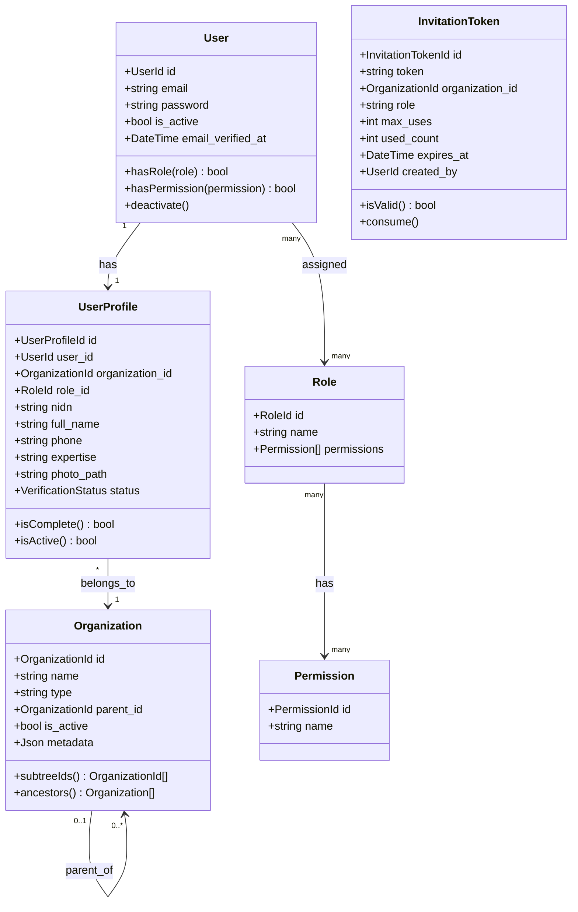

# BC: Identity & Access

**Klasifikasi:** 🟢 Generic Domain  
**Versi:** 2.0  
**Status:** Draft

---

## Responsibility

Mengelola autentikasi, profil user, hierarki organisasi, dan kontrol akses. Dua pilar utama:

- **Spatie Permission** → _apa yang boleh dilakukan_ (authorization)
- **Organization tree** → _dari mana user berasal_ (identity/scope)

Keduanya independen dan menjawab pertanyaan yang berbeda.

---

## Activity Diagram

### Jalur 1 — Self-Register (Dosen ITK)



### Jalur 2 — Invitation Link (External)



### Jalur 3 — Reviewer (Ditunjuk Operator)



---

## Aggregates



---

## Spatie Role Design

**Permissions** (granular, yang di-check di kode):

```
submissions.create          submissions.view-own
submissions.view-all        budget.edit
members.manage              reviewers.assign
reviewers.evaluate          periods.manage
schemes.manage              outputs.manage
users.verify                users.manage
```

**Roles** (bundle permissions):

| Role         | Permissions                                                               |
| ------------ | ------------------------------------------------------------------------- |
| `researcher` | submissions.create, view-own, budget.edit, members.manage, outputs.manage |
| `reviewer`   | reviewers.evaluate, submissions.view-assigned                             |
| `operator`   | submissions.view-all, reviewers.assign, periods.manage, users.verify      |
| `admin`      | semua                                                                     |

Satu user bisa punya beberapa role (e.g., researcher + reviewer). Permission di-check via `$user->can('submissions.create')`, bukan via role name langsung.

---

## Organization Tree Access Check

Access ke form ditentukan oleh intersection role + org:

```php
// Apakah user bisa akses form ini?
function canAccessForm(User $user, Form $form): bool
{
    $userOrgId  = $user->profile->organization_id;
    $userRoles  = $user->getRoleNames();

    return FormAccessControl::where('form_id', $form->id)
        ->whereIn('role_id', Role::whereIn('name', $userRoles)->pluck('id'))
        ->whereIn('organization_id', Organization::subtreeIds($userOrgId))
        ->exists();
}
```

Contoh: FormAccessControl link ke Fakultas Sains → semua user dari prodi manapun di bawah Fakultas Sains otomatis dapat akses.

---

## Business Rules

| Kode      | Rule                                                                                         |
| --------- | -------------------------------------------------------------------------------------------- |
| BR-IAM-01 | Email domain `@itk.ac.id` wajib untuk jalur self-register internal                           |
| BR-IAM-02 | NIDN harus unik di seluruh sistem                                                            |
| BR-IAM-03 | UserProfile wajib lengkap sebelum user bisa membuat Submission                               |
| BR-IAM-04 | User berstatus `pending` tidak bisa submit proposal tapi bisa login                          |
| BR-IAM-05 | Deaktivasi user tidak delete — cukup `is_active = false`                                     |
| BR-IAM-06 | InvitationToken dianggap invalid jika `used_count >= max_uses` atau `expires_at` sudah lewat |
| BR-IAM-07 | User dengan role `reviewer` tidak bisa me-review submission yang ia menjadi member-nya       |
| BR-IAM-08 | Organization tidak bisa di-delete jika masih ada UserProfile yang terhubung ke subtree-nya   |

---

## Domain Events

| Event               | Trigger                  | Consumer     |
| ------------------- | ------------------------ | ------------ |
| `UserRegistered`    | User berhasil register   | Notification |
| `UserVerified`      | Operator verifikasi NIDN | Notification |
| `UserDeactivated`   | Admin nonaktifkan user   | Notification |
| `ReviewerAppointed` | Operator assign reviewer | Notification |

---

## Database Notes

PostgreSQL recursive CTE untuk subtree traversal:

```sql
WITH RECURSIVE org_subtree AS (
    SELECT id FROM organizations WHERE id = $1
    UNION ALL
    SELECT o.id FROM organizations o
    INNER JOIN org_subtree ot ON o.parent_id = ot.id
    WHERE o.is_active = true
)
SELECT id FROM org_subtree;
```

Untuk performa optimal di org tree yang dalam, pertimbangkan `ltree` extension PostgreSQL — tapi adjacency list sudah cukup untuk kebutuhan awal.
