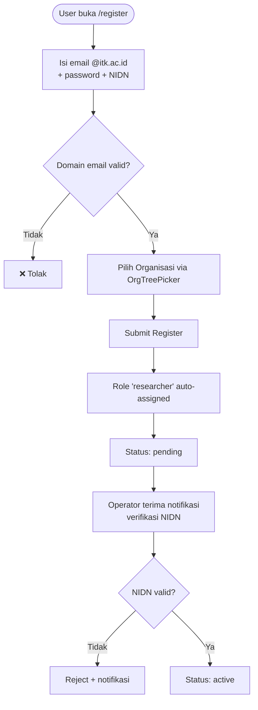
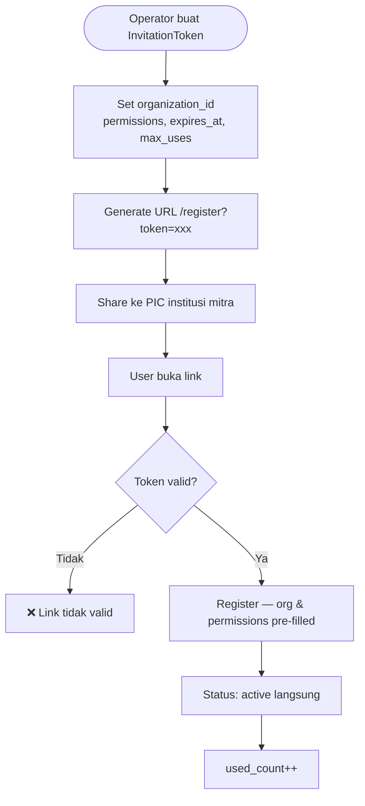
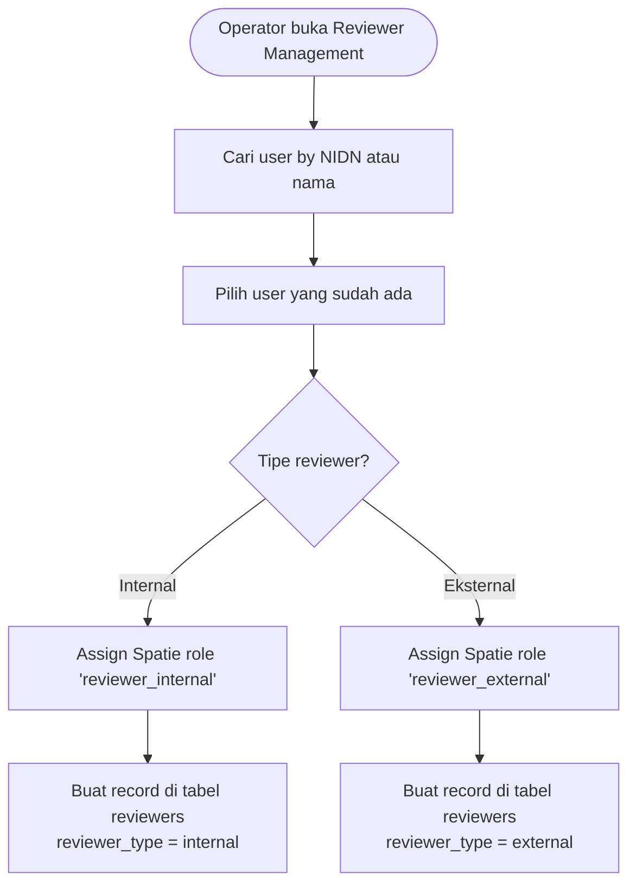
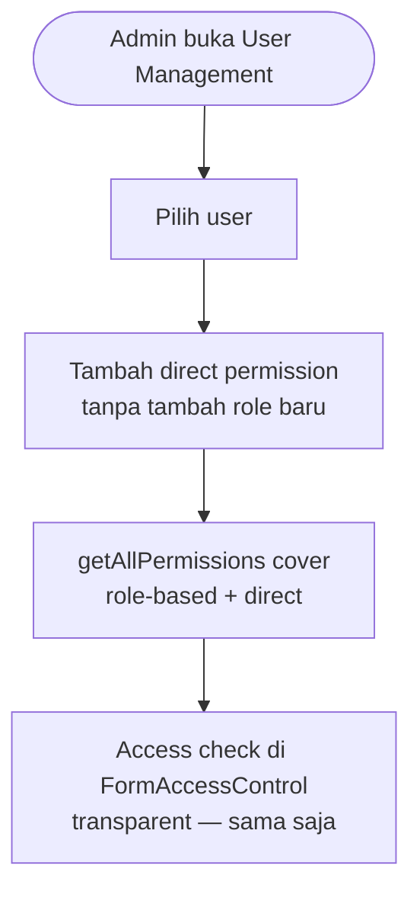
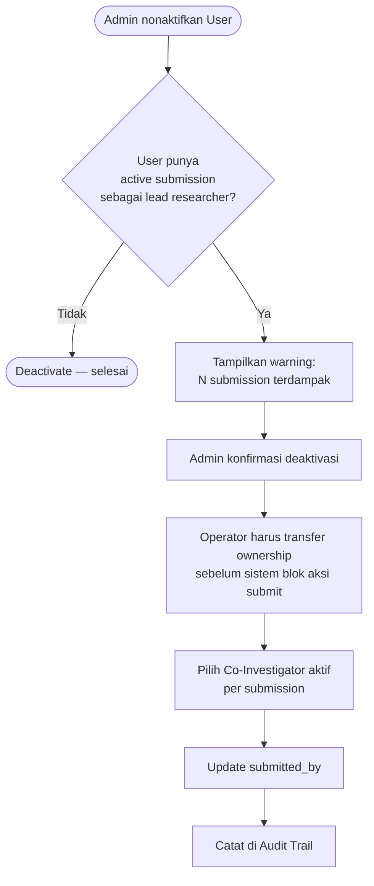
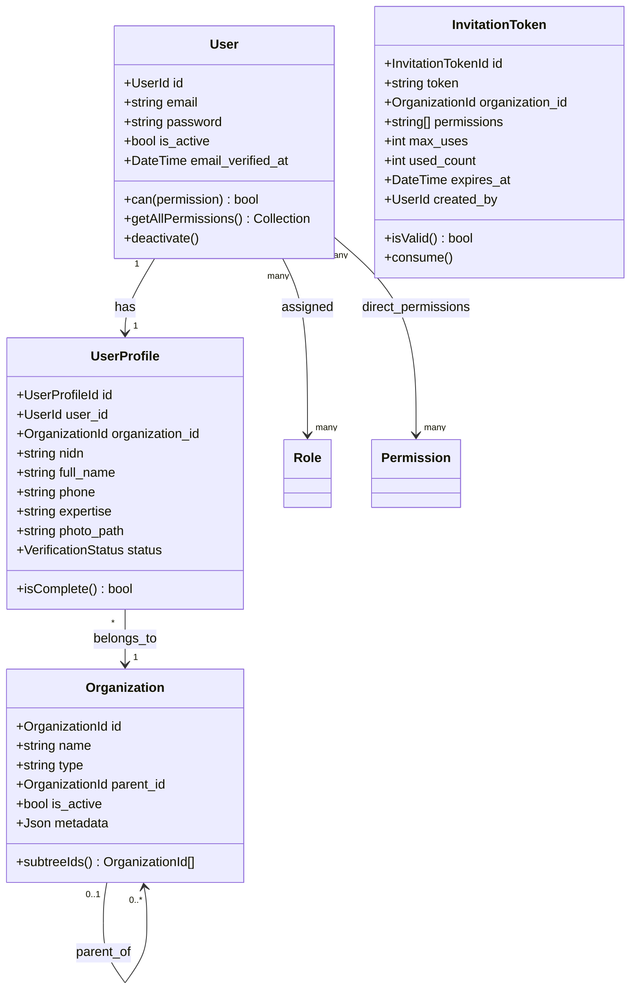

# BC: Identity & Access

**Klasifikasi:** 🟢 Generic Domain  
**Versi:** 2.3  
**Status:** Draft

---

## Responsibility

Mengelola autentikasi, profil user, hierarki organisasi, dan kontrol akses. Dua pilar:

- **Spatie Permission** → _apa yang boleh dilakukan_ (authorization)
- **Organization tree** → _dari mana user berasal_ (identity/scope)

`FormAccessControl` menggunakan **permission + org** — bukan role + org.

---

## Activity Diagram

### Jalur 1 — Self-Register (Dosen ITK)



### Jalur 2 — Invitation Link (External)



### Jalur 3 — Reviewer (Ditunjuk Operator)



### Custom Permission untuk User Spesifik



### Transfer Ownership (Lead Researcher Nonaktif)



---

## Aggregates



---

## Spatie Permission Design

**Permissions:**

```
submissions.create        submissions.view-own
submissions.view-all      budget.edit
members.manage            reviewers.assign
reviewers.evaluate        reviewers.view-scores-others
periods.manage            schemes.manage
outputs.manage            users.verify
users.manage              reporting.export
reporting.view-audit-log
```

**Roles:**

| Role                | Permissions                                                                            |
| ------------------- | -------------------------------------------------------------------------------------- |
| `researcher`        | submissions.create, view-own, budget.edit, members.manage, outputs.manage              |
| `reviewer_internal` | reviewers.evaluate, submissions.view-assigned, reviewers.view-scores-others            |
| `reviewer_external` | reviewers.evaluate, submissions.view-assigned                                          |
| `operator`          | submissions.view-all, reviewers.assign, periods.manage, users.verify, reporting.export |
| `admin`             | semua                                                                                  |

---

## Access Check — Permission + Org

```php
function canAccessForm(User $user, Form $form): bool
{
    $userPermissions = $user->getAllPermissions()->pluck('name');
    $userOrgSubtree  = Organization::subtreeIds($user->profile->organization_id);

    return FormAccessControl::where('form_id', $form->id)
        ->whereIn('permission', $userPermissions)
        ->whereIn('organization_id', $userOrgSubtree)
        ->exists();
}
```

PostgreSQL recursive CTE untuk subtree (bisa di-cache Redis TTL 30 menit):

```sql
WITH RECURSIVE org_subtree AS (
    SELECT id FROM organizations WHERE id = $1
    UNION ALL
    SELECT o.id FROM organizations o
    INNER JOIN org_subtree ot ON o.parent_id = ot.id
    WHERE o.is_active = true
)
SELECT id FROM org_subtree;
```

---

## Business Rules

| Kode      | Rule                                                                                                                                                    |
| --------- | ------------------------------------------------------------------------------------------------------------------------------------------------------- |
| BR-IAM-01 | Email domain `@itk.ac.id` wajib untuk self-register internal                                                                                            |
| BR-IAM-02 | NIDN harus unik di seluruh sistem                                                                                                                       |
| BR-IAM-03 | UserProfile wajib lengkap sebelum Researcher bisa membuat Submission                                                                                    |
| BR-IAM-04 | User status `pending` bisa login tapi tidak bisa submit proposal                                                                                        |
| BR-IAM-05 | Deaktivasi User tidak delete data — `is_active = false`                                                                                                 |
| BR-IAM-06 | InvitationToken invalid jika `used_count >= max_uses` atau `expires_at` lewat                                                                           |
| BR-IAM-07 | User dengan role `reviewer_internal` atau `reviewer_external` tidak bisa me-review submission yang ia menjadi ResearchMember-nya                        |
| BR-IAM-08 | Organization tidak bisa di-delete jika masih ada UserProfile di subtree-nya                                                                             |
| BR-IAM-09 | Direct permission ke user tidak menghapus permission dari role — keduanya additive                                                                      |
| BR-IAM-10 | Jika lead researcher dinonaktifkan dengan active submission, Operator wajib transfer ownership ke Co-Investigator aktif sebelum deaktivasi dikonfirmasi |

---

## Domain Events

| Event               | Trigger                  | Consumer                                           |
| ------------------- | ------------------------ | -------------------------------------------------- |
| `UserRegistered`    | User berhasil register   | Notification                                       |
| `UserVerified`      | Operator verifikasi NIDN | Notification                                       |
| `UserDeactivated`   | Admin nonaktifkan user   | Notification, Submission (trigger ownership check) |
| `ReviewerAppointed` | Operator assign reviewer | Notification                                       |

---

## Integration Map

| Context              | Arah                | Keterangan                                   |
| -------------------- | ------------------- | -------------------------------------------- |
| Submission           | IAM → Downstream    | UserProfileId untuk lead researcher & member |
| Review               | IAM → Downstream    | UserProfileId untuk Reviewer                 |
| System Configuration | Upstream → IAM      | Lookup untuk OrgType definitions             |
| Notification         | IAM → Cross-cutting | Publish events                               |
| Reporting            | IAM → Read          | User data untuk audit trail dan statistik    |
