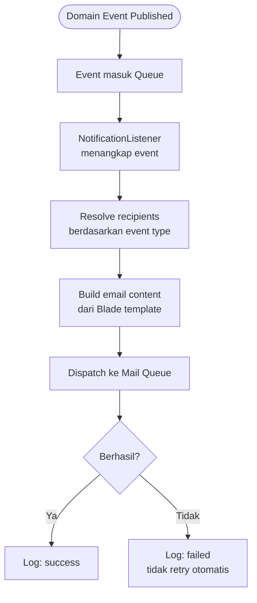

# BC: Notification

**Klasifikasi:** 🟢 Generic Domain  
**Versi:** 2.0  
**Status:** Draft

---

## Responsibility

Consumer dari domain events semua context. Tidak punya business logic — hanya translate event ke email. Implementasi: **Laravel Notification** via queue, channel `mail`.

---

## Activity Diagram

---

## Events yang Dikonsumsi

| Source            | Event                      | Recipients                         |
| ----------------- | -------------------------- | ---------------------------------- |
| Submission        | `ProposalSubmitted`        | LPPM Operator                      |
| Submission        | `ProposalApproved`         | Lead Researcher + Research Members |
| Submission        | `ProposalRejected`         | Lead Researcher                    |
| Review            | `ReviewerAssigned`         | Reviewer                           |
| Review            | `RevisionRequested`        | Lead Researcher                    |
| Monev             | `MonevStageOpened`         | Lead Researcher                    |
| Monev             | `MonevEvaluationSubmitted` | Operator                           |
| Identity & Access | `UserRegistered`           | User (welcome)                     |
| Identity & Access | `UserVerified`             | User                               |
| Identity & Access | `ReviewerAppointed`        | Reviewer                           |
