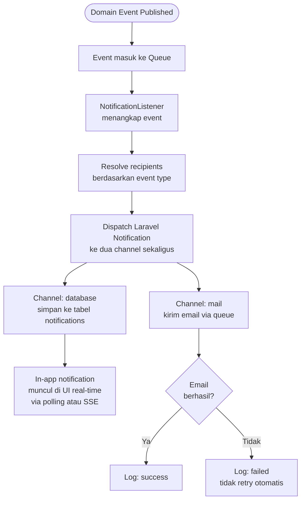
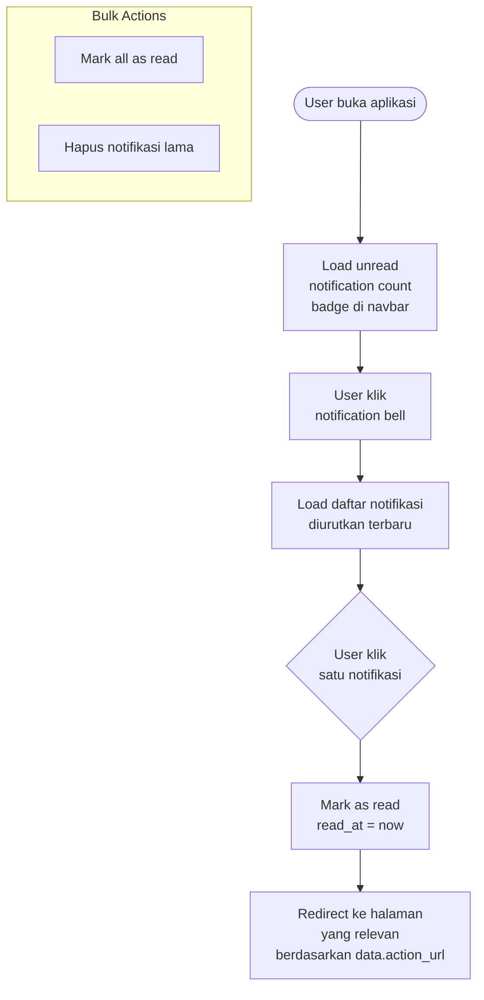

# BC: Notification

**Klasifikasi:** 🟢 Generic Domain  
**Versi:** 2.1  
**Status:** Draft

---

## Responsibility

Mengelola pengiriman notifikasi ke user melalui dua channel: **in-app** (real-time di dalam aplikasi) dan **email**. In-app notification adalah sumber kebenaran utama — email adalah channel tambahan untuk memastikan user yang sedang tidak buka aplikasi tetap mendapat info.

Implementasi: **Laravel Notification** dengan dua channel — `database` (in-app) dan `mail` (email).

---

## Activity Diagram

### Alur Publish & Deliver



### Alur In-App Notification (User)



---

## Schema

Laravel Notification dengan driver `database` otomatis pakai tabel `notifications` bawaan Laravel:

```sql
notifications
  id            uuid PRIMARY KEY
  type          varchar    -- class name notifikasi, e.g. App<br/>otifications\ProposalSubmitted
  notifiable_type varchar  -- 'App\Models\User'
  notifiable_id bigint     -- user_id
  data          jsonb      -- payload bebas — title, message, action_url, meta
  read_at       timestamp nullable
  created_at    timestamp
  updated_at    timestamp
```

Contoh `data` payload:

```json
{
    "title": "Proposal Disetujui",
    "message": "Proposal 'Analisis Sistem XYZ' Anda telah disetujui oleh reviewer.",
    "action_url": "/submissions/123",
    "type": "success",
    "meta": {
        "submission_id": 123,
        "scheme": "DIPA Internal"
    }
}
```

Field `type` di payload (`success`, `info`, `warning`, `error`) dipakai UI untuk menentukan warna dan ikon notifikasi.

---

## Implementasi Laravel

```php
// Contoh Notification class — satu class, dua channel
class ProposalApproved extends Notification implements ShouldQueue
{
    use Queueable;

    public function via(object $notifiable): array
    {
        return ['database', 'mail'];  // dua channel sekaligus
    }

    public function toDatabase(object $notifiable): array
    {
        return [
            'title'      => 'Proposal Disetujui',
            'message'    => "Proposal '{$this->submission->title}' telah disetujui.",
            'action_url' => "/submissions/{$this->submission->id}",
            'type'       => 'success',
            'meta'       => ['submission_id' => $this->submission->id],
        ];
    }

    public function toMail(object $notifiable): MailMessage
    {
        return (new MailMessage)
            ->subject('Proposal Disetujui — SIMPAS')
            ->line("Proposal '{$this->submission->title}' telah disetujui.")
            ->action('Lihat Detail', url("/submissions/{$this->submission->id}"));
    }
}
```

---

## Real-Time di Frontend

Dua opsi, pilih berdasarkan kompleksitas yang diinginkan:

**Opsi A — Polling (simpel, recommended untuk SIMPAS)**

```ts
// composables/useNotifications.ts
const { data, refresh } = useFetch("/api/notifications/unread-count", {
    refreshInterval: 30_000, // poll tiap 30 detik
});
```

Cukup untuk sistem internal universitas. Tidak butuh infrastructure tambahan apapun.

**Opsi B — Server-Sent Events / SSE (real-time tanpa WebSocket)**

```php
// routes/api.php
Route::get('/notifications/stream', function () {
    return response()->stream(function () {
        while (true) {
            $count = auth()->user()->unreadNotifications()->count();
            echo "data: " . json_encode(['count' => $count]) . "<br/><br/>";
            ob_flush(); flush();
            sleep(15);
        }
    }, 200, [
        'Content-Type'  => 'text/event-stream',
        'Cache-Control' => 'no-cache',
        'X-Accel-Buffering' => 'no',
    ]);
});
```

SSE lebih ringan dari WebSocket — koneksi satu arah dari server ke client, tidak butuh Laravel Echo atau Pusher.

Untuk SIMPAS, **Opsi A sudah lebih dari cukup**. Opsi B bisa dipertimbangkan kalau ternyata 30 detik delay terasa terlalu lambat di production.

---

## Events yang Dikonsumsi

| Source            | Event                      | Recipients                         | Channels        |
| ----------------- | -------------------------- | ---------------------------------- | --------------- |
| Submission        | `ProposalSubmitted`        | LPPM Operator                      | In-app + Email  |
| Submission        | `ProposalApproved`         | Lead Researcher + Research Members | In-app + Email  |
| Submission        | `ProposalRejected`         | Lead Researcher                    | In-app + Email  |
| Submission        | `ProposalWithdrawn`        | LPPM Operator                      | In-app          |
| Submission        | `SubmissionPeriodOpened`   | Semua active Researcher            | In-app + Email  |
| Review            | `ReviewerAssigned`         | Reviewer                           | In-app + Email  |
| Review            | `RevisionRequested`        | Lead Researcher                    | In-app + Email  |
| Review            | `RevisionResolved`         | Lead Researcher                    | In-app          |
| Monev             | `MonevStageOpened`         | Lead Researcher                    | In-app + Email  |
| Monev             | `MonevEvaluationSubmitted` | LPPM Operator                      | In-app          |
| Identity & Access | `UserRegistered`           | User baru                          | Email (welcome) |
| Identity & Access | `UserVerified`             | User                               | In-app + Email  |
| Identity & Access | `ReviewerAppointed`        | Reviewer                           | In-app + Email  |
| Reporting         | `ExportFailed`             | User                               | In-app          |

---

## Business Rules

| Kode      | Rule                                                                                                                         |
| --------- | ---------------------------------------------------------------------------------------------------------------------------- |
| BR-NOT-01 | In-app notification disimpan permanen — tidak auto-delete. User bisa hapus manual.                                           |
| BR-NOT-02 | Email hanya dikirim untuk event yang butuh perhatian segera — event minor (RevisionResolved, ProposalWithdrawn) cukup in-app |
| BR-NOT-03 | Notification bersifat fire-and-forget — gagal kirim tidak menghentikan proses bisnis                                         |
| BR-NOT-04 | `read_at` di-set saat user klik notifikasi — bukan saat halaman dibuka                                                       |
| BR-NOT-05 | Unread count di navbar di-cache per user, invalidate saat ada notifikasi baru masuk                                          |
