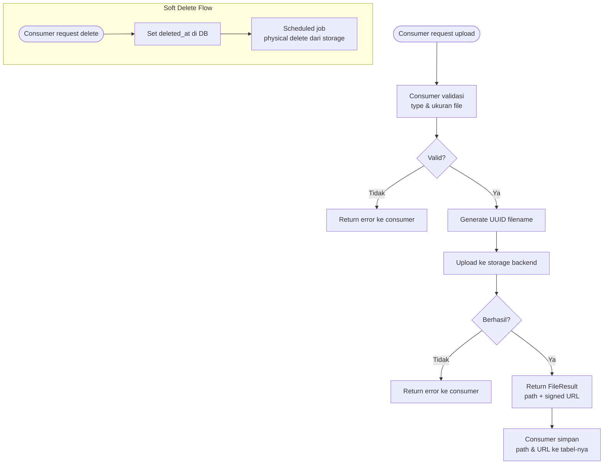

# BC: File Management

**Klasifikasi:** 🟢 Generic Domain  
**Versi:** 2.0  
**Status:** Draft

---

## Responsibility

Layanan upload, storage, dan retrieval file. Consumer tidak perlu tahu storage backend yang dipakai.

| Environment | Provider                       |
| ----------- | ------------------------------ |
| Development | MinIO (Docker, S3-compatible)  |
| Staging     | MinIO (VPS)                    |
| Production  | Cloudflare R2 (no egress cost) |

---

## Activity Diagram



---

## Interface

```php
interface StorageService {
    public function upload(UploadedFile $file, string $path): FileResult;
    public function delete(string $path): void;
    public function getUrl(string $path, ?int $expiresInMinutes = null): string;
}
```

File type validation adalah tanggung jawab consumer context, bukan BC ini.
