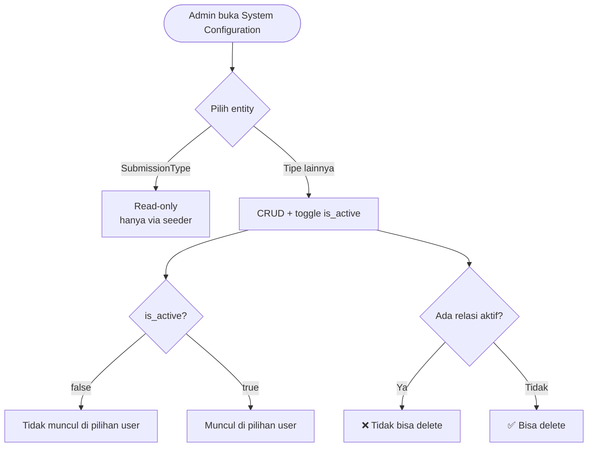
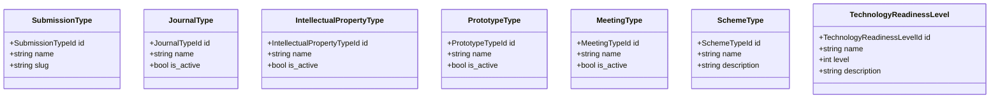

# BC: System Configuration

**Klasifikasi:** 🟢 Generic Domain  
**Versi:** 2.0  
**Status:** Draft

---

## Responsibility

Master data yang digunakan context lain sebagai lookup. **Tidak lagi** mencakup Faculty dan StudyProgram — keduanya sudah digantikan oleh `Organization` tree di BC Identity & Access.

---

## Activity Diagram

---

## Entities

## Data per Consumer

| Entity | Dikonsumsi oleh |
|---|---|
| `SubmissionType` | Scheme, Submission, Review, Monev |
| `JournalType` | Research Output |
| `IntellectualPropertyType` | Research Output |
| `PrototypeType` | Research Output |
| `MeetingType` | Research Output |
| `SchemeType` | Scheme |
| `TechnologyReadinessLevel` | Scheme |

## Business Rules

| Kode | Rule |
|---|---|
| BR-SC-01 | Entity tidak bisa di-delete jika masih ada relasi aktif |
| BR-SC-02 | `SubmissionType` immutable — hanya via seeder |
| BR-SC-03 | Perubahan nama entity tidak mengubah data historis |
