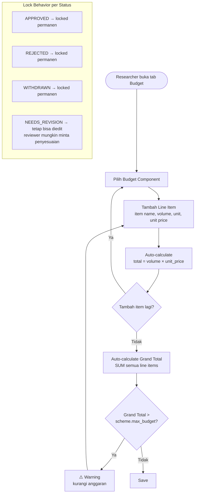
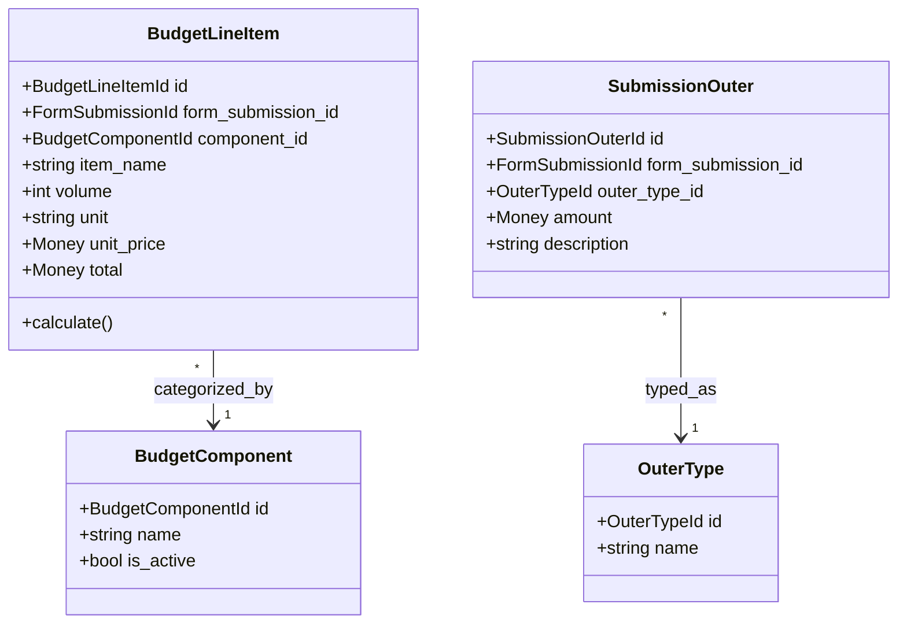

# BC: Budget

**Klasifikasi:** 🟡 Supporting Domain  
**Versi:** 2.3  
**Status:** Draft

---

## Responsibility

Mengelola rencana anggaran belanja untuk sebuah Submission. Grand total selalu dikalkulasi on-the-fly — tidak disimpan sebagai kolom terpisah. Budget dikunci pada state terminal (APPROVED, REJECTED, WITHDRAWN) dan tetap bisa diedit saat NEEDS_REVISION.

---

## Activity Diagram

### Alur Input Budget



---

## Aggregates



---

## Grand Total

Selalu dikalkulasi on-the-fly — tidak ada kolom yang menyimpannya:

```php
// Di BudgetService atau langsung di controller
$grandTotal = BudgetLineItem::where('form_submission_id', $submissionId)->sum('total');
```

Tidak ada sync issue. Tidak ada stale data. Untuk skala SIMPAS, satu aggregate query ini tidak menjadi bottleneck.

---

## Lock Behavior

| Submission Status | Budget Editable?                                    |
| ----------------- | --------------------------------------------------- |
| `DRAFT`           | ✅ Ya                                               |
| `SUBMITTED`       | ✅ Ya                                               |
| `UNDER_REVIEW`    | ✅ Ya                                               |
| `NEEDS_REVISION`  | ✅ Ya — reviewer mungkin minta penyesuaian anggaran |
| `RESUBMITTED`     | ✅ Ya                                               |
| `APPROVED`        | ❌ Locked permanen                                  |
| `REJECTED`        | ❌ Locked permanen                                  |
| `WITHDRAWN`       | ❌ Locked permanen                                  |

---

## Business Rules

| Kode      | Rule                                                                                                                                                                                            |
| --------- | ----------------------------------------------------------------------------------------------------------------------------------------------------------------------------------------------- |
| BR-BUD-01 | Grand total (computed dari SUM line items) tidak boleh melebihi `scheme.max_budget`                                                                                                             |
| BR-BUD-02 | Budget locked saat submission berstatus APPROVED, REJECTED, atau WITHDRAWN                                                                                                                      |
| BR-BUD-03 | Budget tetap bisa diedit saat NEEDS_REVISION                                                                                                                                                    |
| BR-BUD-04 | Volume > 0 dan unit_price > 0 untuk setiap BudgetLineItem                                                                                                                                       |
| BR-BUD-05 | BudgetComponent yang `is_active = false` tidak bisa dipilih untuk item baru                                                                                                                     |
| BR-BUD-06 | SubmissionOuter hanya bisa diubah jika period config mengizinkan                                                                                                                                |
| BR-BUD-07 | Grand total selalu computed (`SUM(total)`) — tidak ada kolom grand total yang disimpan                                                                                                          |
| BR-BUD-08 | Setiap perubahan BudgetLineItem saat submission berstatus NEEDS_REVISION wajib dicatat di audit trail dengan nilai sebelum dan sesudah — untuk keperluan dispute antara reviewer dan researcher |

---

## Domain Events

| Event                   | Trigger                                                 | Consumer                                      |
| ----------------------- | ------------------------------------------------------- | --------------------------------------------- |
| `BudgetLocked`          | ProposalApproved / ProposalRejected / ProposalWithdrawn | —                                             |
| `BudgetLineItemChanged` | BudgetLineItem diubah saat status NEEDS_REVISION        | Reporting (audit trail dengan old/new values) |

---

## Integration Map

| Context    | Arah              | Keterangan                                       |
| ---------- | ----------------- | ------------------------------------------------ |
| Submission | Upstream → Budget | FK ke form_submission_id, status menentukan lock |
| Scheme     | Upstream → Budget | max_budget untuk validasi grand total            |
| Reporting  | Budget → Read     | Data anggaran untuk export dan laporan           |
