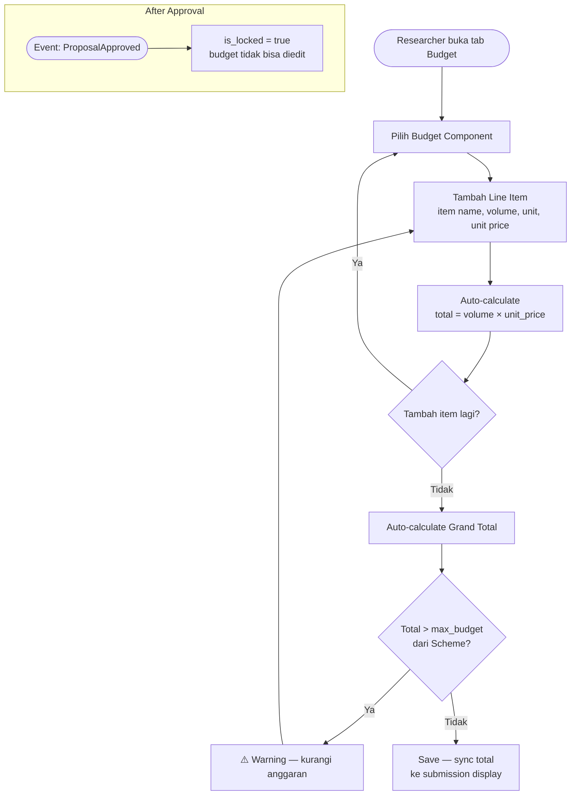
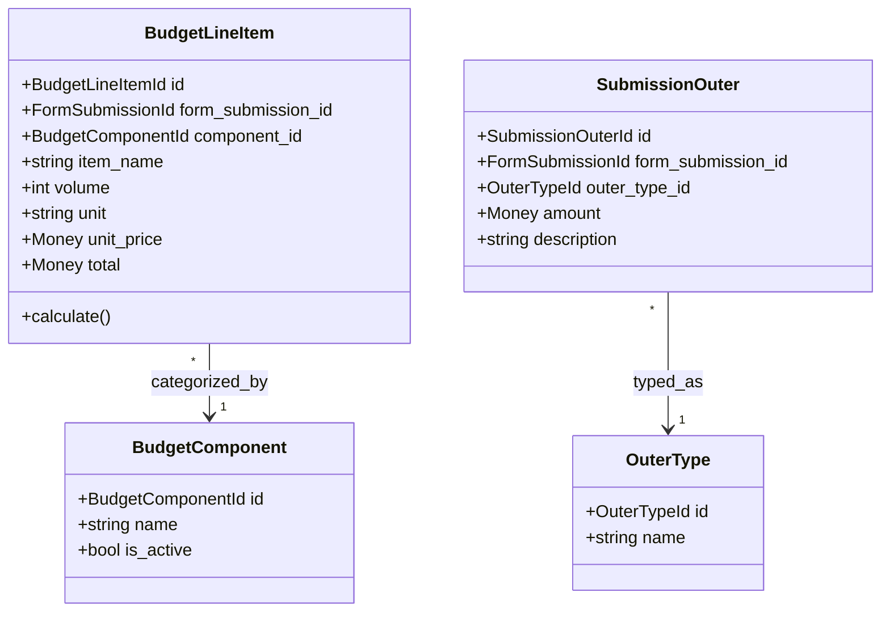

# BC: Budget

**Klasifikasi:** 🟡 Supporting Domain  
**Versi:** 2.0  
**Status:** Draft

---

## Responsibility

Mengelola rencana anggaran untuk sebuah Submission. Semua data FK ke `form_submission_id` — tidak ada tabel `submissions` terpisah. Anggaran dikunci setelah Submission `APPROVED`.

---

## Activity Diagram

---

## Aggregates

---

## Business Rules

| Kode      | Rule                                                                                  |
| --------- | ------------------------------------------------------------------------------------- |
| BR-BUD-01 | Total BudgetLineItems ≤ `schemes.max_budget`                                          |
| BR-BUD-02 | Budget tidak bisa diedit setelah Submission `APPROVED`                                |
| BR-BUD-03 | Volume > 0 dan unit_price > 0 untuk setiap BudgetLineItem                             |
| BR-BUD-04 | SubmissionOuter hanya bisa diubah jika period config mengizinkan (`can_update_outer`) |
| BR-BUD-05 | BudgetComponent yang `is_active = false` tidak bisa dipilih untuk item baru           |

---

## Domain Events

| Event          | Trigger                   | Consumer |
| -------------- | ------------------------- | -------- |
| `BudgetLocked` | ProposalApproved diterima | —        |
