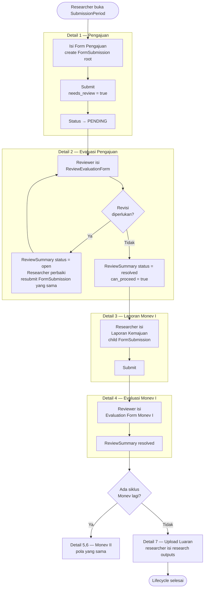
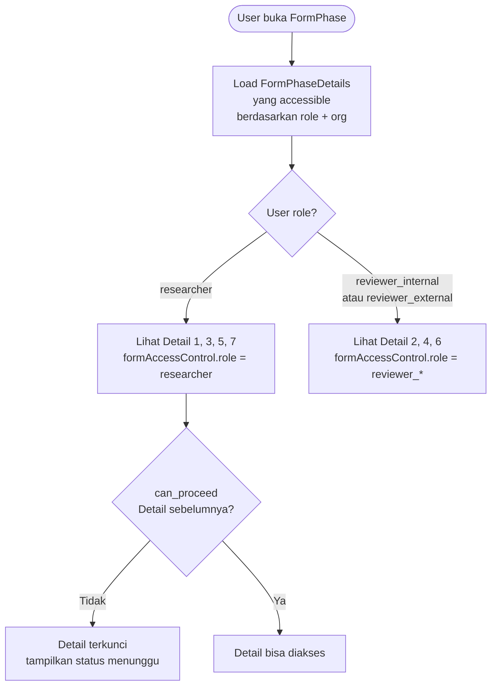

# BC: Monev (Monitoring & Evaluation)

**Klasifikasi:** 🟡 Supporting Domain  
**Versi:** 2.2  
**Status:** Draft

> "Monev" dipertahankan sebagai domain term.

---

## Responsibility

Mengelola siklus monitoring dan evaluasi. Monev **bukan FormPhase terpisah** — dia adalah bagian dari satu FormPhase yang sama dengan pengajuan dan revisi. FormPhaseDetail dan access control yang menentukan siapa bisa akses tahap apa. Ini memastikan semua FormSubmission dalam satu lifecycle penelitian terhubung secara natural.

---

## Konsep Kunci: Satu FormPhase, Satu Lifecycle

```
FormPhase: "Penelitian DIPA 2025"
│  (satu phase untuk seluruh lifecycle satu skema/periode)
│
├── Detail 1  order=1  Pengajuan         researcher  needs_review=true   deadline="Batas Submit"
├── Detail 2  order=2  Evaluasi Pengajuan reviewer    (ReviewEvaluationForm)  deadline="Batas Submit"
│             ← gate: researcher tidak bisa akses Detail 3
│               sebelum semua ReviewSummary resolved
│
├── Detail 3  order=3  Laporan Monev I   researcher  needs_review=true   deadline="Batas Monev I"
├── Detail 4  order=4  Evaluasi Monev I  reviewer    (ReviewEvaluationForm)  deadline="Batas Monev I"
│
├── Detail 5  order=5  Laporan Monev II  researcher  needs_review=false  deadline="Batas Monev II"
├── Detail 6  order=6  Evaluasi Monev II reviewer    (ReviewEvaluationForm)  deadline="Batas Monev II"
│
└── Detail 7  order=7  Upload Luaran     researcher  needs_review=false  deadline="Batas Akhir Period"
```

Semua FormSubmission dalam lifecycle ini punya `parent_submission_id` → FormSubmission pertama (pengajuan). Tidak ada ambiguitas "monev ini dari pengajuan yang mana."

---

## Activity Diagram

### Satu Lifecycle Penuh



### Access Control per Detail



---

## Tidak Ada Tabel Baru

| Data                        | Tabel yang dipakai                                      |
| --------------------------- | ------------------------------------------------------- |
| Laporan kemajuan researcher | `form_submissions` (child) + `form_field_responses`     |
| File laporan                | `form_field_responses` (field_type = file)              |
| Penilaian reviewer          | `review_form_responses` + `review_form_field_responses` |
| Diskusi & catatan           | `review_summaries` + `review_comments`                  |
| Luaran                      | `research_outputs` + `research_output_files`            |

---

## Konfigurasi oleh Operator

Operator bisa tambah/hapus siklus Monev tanpa sentuh kode:

| Aksi                    | Cara                                                     |
| ----------------------- | -------------------------------------------------------- |
| Tambah Monev III        | Tambah FormPhaseDetail order=9,10 ke FormPhase yang sama |
| Hapus Monev II          | Nonaktifkan FormPhaseDetail order=5,6                    |
| Ubah form laporan       | Edit FormField di Form "Laporan Kemajuan"                |
| Ubah kriteria penilaian | Edit ReviewFormField di ReviewEvaluationForm             |

---

## Business Rules

| Kode      | Rule                                                                                                                |
| --------- | ------------------------------------------------------------------------------------------------------------------- |
| BR-MON-01 | Monev hanya bisa diakses setelah FormSubmission pengajuan utama berstatus `APPROVED`                                |
| BR-MON-02 | Researcher tidak bisa mengisi Detail berikutnya sebelum `can_proceed = true` dari Detail yang `needs_review = true` |
| BR-MON-03 | Satu researcher hanya bisa punya satu child FormSubmission per FormPhaseDetail                                      |
| BR-MON-04 | Reviewer yang di-assign ke Monev bisa berbeda dengan reviewer pengajuan awal                                        |

---

## Domain Events

| Event                      | Trigger                                  | Consumer     |
| -------------------------- | ---------------------------------------- | ------------ |
| `MonevStageOpened`         | Operator aktifkan FormPhaseDetail monev  | Notification |
| `MonevEvaluationSubmitted` | Reviewer submit ReviewFormResponse monev | Notification |

---

## Integration Map

| Context     | Arah             | Keterangan                                        |
| ----------- | ---------------- | ------------------------------------------------- |
| Form Engine | Upstream → Monev | Semua infrastruktur dari FE — tidak ada yang baru |
| Submission  | Upstream → Monev | Parent FormSubmission harus APPROVED              |
| Review      | Lateral          | Pola ReviewEvaluationForm + ReviewSummary identik |
