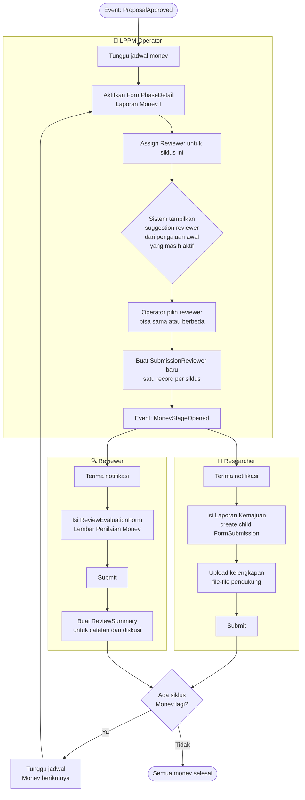
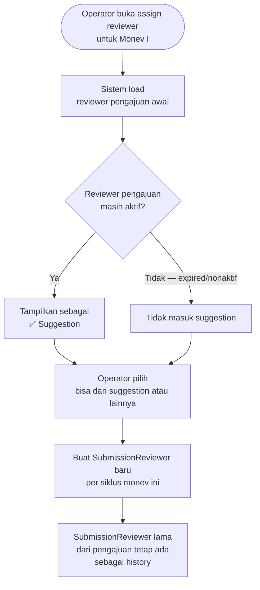

# BC: Monev (Monitoring & Evaluation)

**Klasifikasi:** 🟡 Supporting Domain  
**Versi:** 2.3  
**Status:** Draft

---

## Responsibility

Mengelola siklus monitoring dan evaluasi untuk Submission yang sudah APPROVED. Monev adalah bagian dari satu FormPhase yang sama dengan pengajuan — bukan phase terpisah. Reviewer untuk setiap siklus monev di-assign manual oleh Operator dengan suggestion dari reviewer pengajuan awal.

---

## Konsep Kunci: Satu FormPhase, Satu Lifecycle

```
FormPhase: "Penelitian DIPA 2025"
│
├── Detail 1  order=1  Pengajuan          researcher    needs_review=true   deadline="Batas Submit"
├── Detail 2  order=2  Evaluasi Pengajuan reviewer      ReviewEvaluationForm deadline="Batas Submit"
│             ← gate: tidak bisa lanjut sebelum semua ReviewSummary resolved
│
├── Detail 3  order=3  Laporan Monev I    researcher    needs_review=true   deadline="Batas Monev I"
│             ← child FormSubmission (parent = submission pengajuan utama)
├── Detail 4  order=4  Evaluasi Monev I   reviewer      ReviewEvaluationForm deadline="Batas Monev I"
│
├── Detail 5  order=5  Laporan Monev II   researcher    needs_review=false  deadline="Batas Monev II"
├── Detail 6  order=6  Evaluasi Monev II  reviewer      ReviewEvaluationForm deadline="Batas Monev II"
│
└── Detail 7  order=7  Upload Luaran      researcher    needs_review=false  deadline="Batas Akhir"
```

Semua FormSubmission dalam lifecycle ini terhubung via `parent_submission_id` ke submission pengajuan utama. Tidak ada ambiguitas "monev ini dari pengajuan yang mana."

---

## Activity Diagram

### Alur Siklus Monev



---

## Tidak Ada Tabel Baru

| Data                         | Tabel yang dipakai                                                        |
| ---------------------------- | ------------------------------------------------------------------------- |
| Laporan kemajuan researcher  | `form_submissions` (child) + `form_field_responses`                       |
| File laporan dan kelengkapan | `form_field_responses` (field_type = file)                                |
| Penilaian reviewer           | `review_form_responses` + `review_form_field_responses`                   |
| Catatan dan diskusi          | `review_summaries` + `review_comments`                                    |
| Luaran penelitian            | `research_outputs` (extension table terpisah, bukan child FormSubmission) |

---

## Reviewer Assignment per Siklus



---

## Business Rules

| Kode      | Rule                                                                                                                |
| --------- | ------------------------------------------------------------------------------------------------------------------- |
| BR-MON-01 | Monev hanya bisa diakses setelah FormSubmission pengajuan utama berstatus APPROVED                                  |
| BR-MON-02 | Researcher tidak bisa mengisi Detail berikutnya sebelum `can_proceed = true` dari Detail sebelumnya                 |
| BR-MON-03 | Satu researcher hanya bisa punya satu child FormSubmission per FormPhaseDetail                                      |
| BR-MON-04 | Reviewer untuk setiap siklus monev di-assign manual oleh Operator                                                   |
| BR-MON-05 | Setiap FormPhaseDetail monev punya hard deadline — lewat deadline, akses ditutup kecuali ada FormSubmissionOverride |
| BR-MON-06 | Satu SubmissionReviewer baru dibuat per siklus — tidak reuse record dari siklus sebelumnya                          |
| BR-MON-07 | Reviewer pengajuan awal yang sudah tidak aktif (expired `end_date`) tidak muncul di suggestion monev                |
| BR-MON-08 | Submission yang WITHDRAWN saat monev sedang berjalan — siklus monev aktif di-freeze, tidak bisa submit laporan baru |

---

## Domain Events

| Event                      | Trigger                                 | Consumer     |
| -------------------------- | --------------------------------------- | ------------ |
| `MonevStageOpened`         | Operator aktifkan FormPhaseDetail monev | Notification |
| `MonevEvaluationSubmitted` | Reviewer submit penilaian monev         | Notification |

---

## Integration Map

| Context     | Arah             | Keterangan                                        |
| ----------- | ---------------- | ------------------------------------------------- |
| Form Engine | Upstream → Monev | Semua infrastruktur dari FE — tidak ada yang baru |
| Submission  | Upstream → Monev | Parent FormSubmission harus APPROVED              |
| Review      | Lateral          | Pola ReviewEvaluationForm + ReviewSummary identik |
| Reporting   | Monev → Read     | Data monev untuk laporan progress dan export      |
