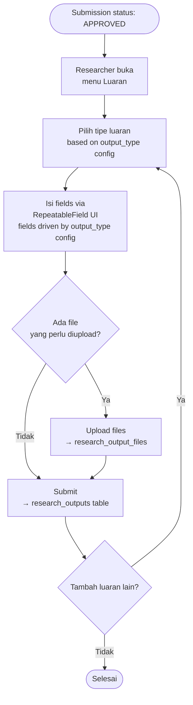

# BC: Research Output

**Klasifikasi:** 🟡 Supporting Domain  
**Versi:** 2.1  
**Status:** Draft

---

## Responsibility

Mengelola semua luaran dari kegiatan yang sudah disetujui. Menggunakan **satu tabel generik** dengan JSONB metadata — menambah tipe luaran baru tidak butuh migration, hanya definisi config baru.

---

## Activity Diagram



---

## Schema

```sql
research_outputs
  id
  form_submission_id   FK → form_submissions
  output_type          varchar   -- 'article', 'book', 'ip', 'prototype', 'pks', 'meeting'
  metadata             JSONB     -- semua field spesifik per tipe
  created_at, updated_at

research_output_files
  id
  research_output_id   FK → research_outputs
  file_path            varchar
  file_url             varchar
  created_at, updated_at
```

### Contoh Metadata per Output Type

```json
// article
{
  "title": "...", "journal_name": "...", "journal_type": "international_reputable",
  "year": 2025, "doi": "10.xxxx/...", "url": "https://..."
}

// book
{
  "title": "...", "publisher": "...", "year": 2025, "isbn": "..."
}

// ip (Intellectual Property)
{
  "title": "...", "ip_type": "patent",
  "registration_number": "...", "registration_date": "2025-01-01", "status": "granted"
}

// prototype
{
  "name": "...", "prototype_type": "software", "description": "..."
}

// pks (Cooperation Agreement)
{
  "title": "...", "involved_parties": "...", "description": "...",
  "start_date": "2025-01-01", "end_date": null
}

// meeting
{
  "title": "...", "meeting_type": "seminar", "year": 2025, "description": "..."
}
```

### Menambah Tipe Luaran Baru

Tidak perlu migration. Cukup tambah config baru di `output_type_definitions` (bisa di System Configuration atau hardcoded di application config):

```php
// config/research_output_types.php
'poster' => [
    'label'  => 'Poster Ilmiah',
    'fields' => [
        ['key' => 'title',  'label' => 'Judul',         'type' => 'text',   'required' => true],
        ['key' => 'event',  'label' => 'Nama Event',    'type' => 'text',   'required' => true],
        ['key' => 'year',   'label' => 'Tahun',         'type' => 'number', 'required' => true],
    ],
    'has_files' => true,
],
```

### Query ke JSONB (PostgreSQL)

```sql
-- Artikel bereputasi internasional tahun ini
SELECT * FROM research_outputs
WHERE output_type = 'article'
  AND metadata->>'journal_type' = 'international_reputable'
  AND (metadata->>'year')::int = 2025;

-- GIN index untuk performa
CREATE INDEX idx_research_outputs_metadata ON research_outputs USING GIN (metadata);
```

---

## Business Rules

| Kode     | Rule                                                                                         |
| -------- | -------------------------------------------------------------------------------------------- |
| BR-RO-01 | Research Output hanya bisa ditambahkan untuk Submission berstatus `APPROVED`                 |
| BR-RO-02 | `output_type = 'pks'` hanya valid untuk Submission dengan SubmissionType = Community Service |
| BR-RO-03 | `metadata.end_date` boleh null untuk PKS yang ongoing                                        |
| BR-RO-04 | Output type `ip` dan `prototype` wajib punya minimal satu file di `research_output_files`    |
| BR-RO-05 | `output_type` harus terdaftar di `output_type_definitions` — tidak bisa arbitrary string     |

---

## Integration Map

| Context              | Arah                       | Keterangan                              |
| -------------------- | -------------------------- | --------------------------------------- |
| Submission           | Upstream → Research Output | Eligibility check via APPROVED status   |
| File Management      | Upstream → Research Output | Upload files ke `research_output_files` |
| System Configuration | Upstream → Research Output | `output_type_definitions` config        |
