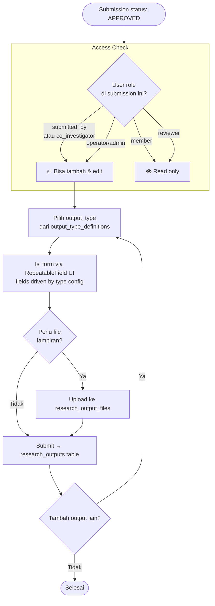

# BC: Research Output

**Klasifikasi:** 🟡 Supporting Domain  
**Versi:** 2.3  
**Status:** Draft

---

## Responsibility

Mengelola semua luaran dari kegiatan yang sudah disetujui. Disimpan di satu tabel generik `research_outputs` dengan JSONB metadata — menambah tipe luaran baru tidak butuh migration. Research Output **bukan** child FormSubmission — dia punya extension table sendiri dengan lifecycle yang berbeda.

---

## Activity Diagram

### Alur Upload Research Output



---

## Schema

```sql
research_outputs
  id
  form_submission_id   FK → form_submissions
  output_type          varchar   -- 'article', 'book', 'ip', 'prototype', 'pks', 'meeting'
  metadata             JSONB
  created_by           FK → users
  created_at, updated_at

research_output_files
  id
  research_output_id   FK → research_outputs
  file_path            varchar
  file_url             varchar
  created_at, updated_at
```

### Contoh Metadata per Output Type

```json
// article
{
  "title": "...", "journal_name": "...", "journal_type": "international_reputable",
  "year": 2025, "doi": "10.xxxx/...", "url": "..."
}

// book
{ "title": "...", "publisher": "...", "year": 2025, "isbn": "..." }

// ip (Intellectual Property)
{
  "title": "...", "ip_type": "patent",
  "registration_number": "...", "registration_date": "2025-01-01", "status": "granted"
}

// prototype
{ "name": "...", "prototype_type": "software", "description": "..." }

// pks (Cooperation Agreement)
{
  "title": "...", "involved_parties": "...", "description": "...",
  "start_date": "2025-01-01", "end_date": null
}

// meeting
{ "title": "...", "meeting_type": "seminar", "year": 2025, "description": "..." }
```

### Menambah Tipe Output Baru

Tidak perlu migration. Tambah entry di `config/research_output_types.php`:

```php
'poster' => [
    'label'    => 'Poster Ilmiah',
    'has_files' => true,
    'fields'   => [
        ['key' => 'title', 'label' => 'Judul', 'type' => 'text', 'required' => true],
        ['key' => 'event', 'label' => 'Nama Event', 'type' => 'text', 'required' => true],
        ['key' => 'year',  'label' => 'Tahun', 'type' => 'number', 'required' => true],
    ],
],
```

### Query ke JSONB (PostgreSQL)

```sql
-- Artikel bereputasi internasional tahun ini
SELECT * FROM research_outputs
WHERE output_type = 'article'
  AND metadata->>'journal_type' = 'international_reputable'
  AND (metadata->>'year')::int = 2025;

-- GIN index untuk performa
CREATE INDEX idx_research_outputs_metadata ON research_outputs USING GIN (metadata);
```

---

## Access Control

| User                                    | Akses                                       |
| --------------------------------------- | ------------------------------------------- |
| `submitted_by` (Lead Researcher)        | Full access — tambah, edit, hapus           |
| `ResearchMember` role `co_investigator` | Bisa tambah dan edit                        |
| `ResearchMember` role `member`          | Read only                                   |
| Reviewer (via SubmissionReviewer)       | Read only                                   |
| Operator / Admin                        | Full access via `outputs.manage` permission |

---

## Business Rules

| Kode     | Rule                                                                                                          |
| -------- | ------------------------------------------------------------------------------------------------------------- |
| BR-RO-01 | Research Output hanya bisa ditambahkan untuk Submission berstatus APPROVED                                    |
| BR-RO-02 | `output_type = 'pks'` hanya valid untuk Submission dengan SubmissionType = CommunityService                   |
| BR-RO-03 | `metadata.end_date` boleh null untuk PKS yang ongoing                                                         |
| BR-RO-04 | `output_type = 'ip'` dan `output_type = 'prototype'` wajib punya minimal satu file di `research_output_files` |
| BR-RO-05 | `output_type` harus terdaftar di `output_type_definitions` — tidak bisa arbitrary string                      |
| BR-RO-06 | Research Output tetap ada sebagai data historis setelah submission WITHDRAWN — tidak dihapus                  |
| BR-RO-07 | Hanya `submitted_by` dan `co_investigator` yang bisa tambah atau edit output — `member` read only             |

---

## Domain Events

| Event         | Trigger                                       | Consumer                           |
| ------------- | --------------------------------------------- | ---------------------------------- |
| `OutputAdded` | Researcher/Co-Investigator tambah output baru | Notification (opsional), Reporting |

---

## Integration Map

| Context              | Arah                       | Keterangan                                |
| -------------------- | -------------------------- | ----------------------------------------- |
| Submission           | Upstream → Research Output | Eligibility check: hanya untuk APPROVED   |
| File Management      | Upstream → Research Output | Upload research_output_files              |
| System Configuration | Upstream → Research Output | output_type_definitions config            |
| Reporting            | Research Output → Read     | Data luaran untuk export dan laporan LPPM |
