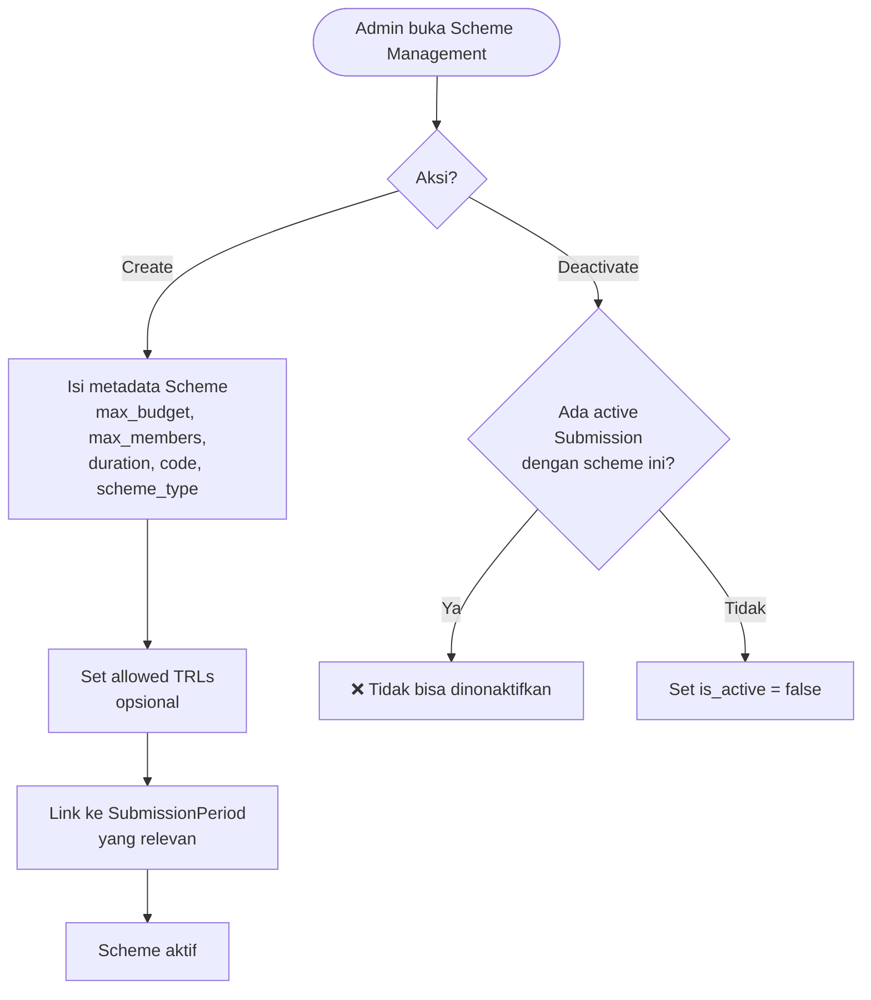
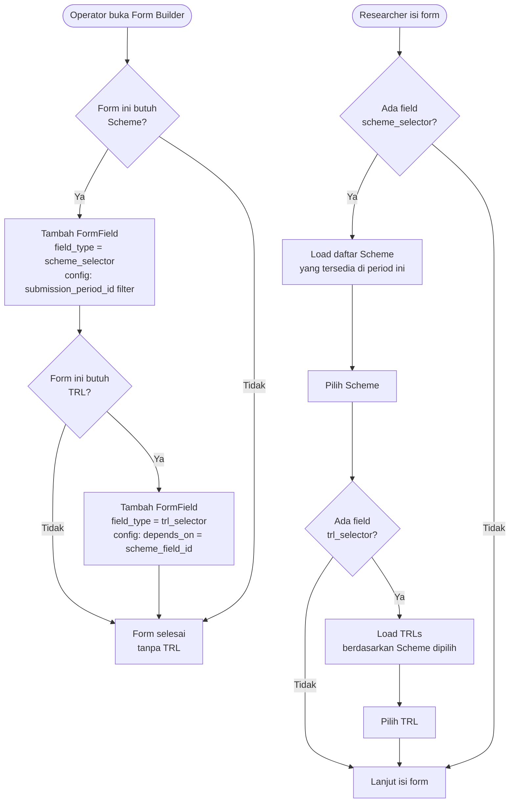
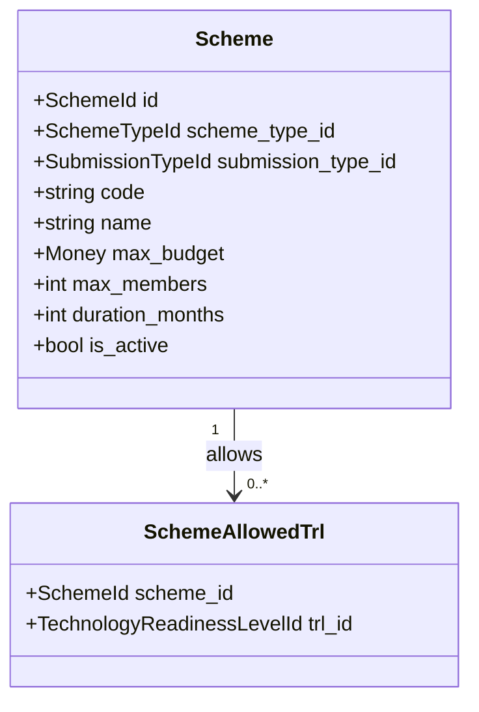

# BC: Scheme

**Klasifikasi:** 🟡 Supporting Domain  
**Versi:** 2.1  
**Status:** Draft

---

## Responsibility

Mengelola metadata aturan skema penelitian/pengabdian. Scheme **decoupled dari Form** — Form tidak mengetahui Scheme. Sebaliknya, `form_submissions` yang opsional menyimpan `scheme_id`. Pemilihan Scheme dan TRL dikontrol oleh FormField khusus (`scheme_selector`, `trl_selector`) — jika Form tidak punya field tersebut, submission tidak butuh Scheme/TRL sama sekali.

---

## Activity Diagram

### Alur Konfigurasi Scheme



### Bagaimana Scheme Terhubung ke Form

Operator menambahkan field dengan tipe `scheme_selector` ke sebuah Form jika submission tersebut butuh pemilihan skema. Jika tidak ditambahkan, Form berjalan tanpa Scheme.



---

## Schema

```sql
schemes
  id
  scheme_type_id      FK → scheme_types
  submission_type_id  FK → submission_types
  code                varchar UNIQUE
  name                varchar
  max_budget          bigint
  max_members         int
  duration_months     int
  is_active           boolean

scheme_allowed_trls
  scheme_id   FK → schemes
  trl_id      FK → technology_readiness_levels

-- form_submissions dapat scheme_id nullable
-- scheme dipilih saat researcher mengisi form_field dengan type 'scheme_selector'
-- nilainya disimpan di form_field_responses.value
-- dan di-denormalize ke form_submissions.scheme_id untuk query efisien
```

---

## Field Type: `scheme_selector` & `trl_selector`

Dua field type baru yang ditambahkan ke `field_types`:

**`scheme_selector`** — render dropdown berisi daftar Scheme yang tersedia di SubmissionPeriod aktif. Config:

```json
{
    "filter_by_submission_type": true,
    "show_max_budget": true,
    "show_max_members": true
}
```

**`trl_selector`** — render dropdown TRL yang filtered berdasarkan Scheme yang dipilih. Config:

```json
{
    "depends_on_field_key": "scheme_field_id",
    "allow_empty": true
}
```

Jika `allow_empty: true`, Researcher tidak wajib memilih TRL meskipun field ini ada di form.

---

## Aggregates



---

## Business Rules

| Kode      | Rule                                                                                      |
| --------- | ----------------------------------------------------------------------------------------- |
| BR-SCH-01 | Scheme tidak bisa di-deactivate jika ada active Submission yang menggunakannya            |
| BR-SCH-02 | `max_budget > 0` dan `max_members > 0`                                                    |
| BR-SCH-03 | `code` unik di seluruh sistem                                                             |
| BR-SCH-04 | Form tidak diwajibkan punya `scheme_selector` field — Scheme sepenuhnya opsional per Form |
| BR-SCH-05 | `trl_selector` hanya valid jika ada `scheme_selector` di Form yang sama                   |

---

## Integration Map

| Context              | Arah                | Keterangan                                                                             |
| -------------------- | ------------------- | -------------------------------------------------------------------------------------- |
| Form Engine          | Lateral             | `scheme_selector` adalah FormField type — FE render UI-nya, Scheme BC provide data-nya |
| System Configuration | Upstream → Scheme   | SchemeTypeId, TRLId, SubmissionTypeId                                                  |
| Submission           | Scheme → Downstream | Budget validation via max_budget, member count via max_members                         |
| Budget               | Scheme → Downstream | max_budget untuk validasi total anggaran                                               |
