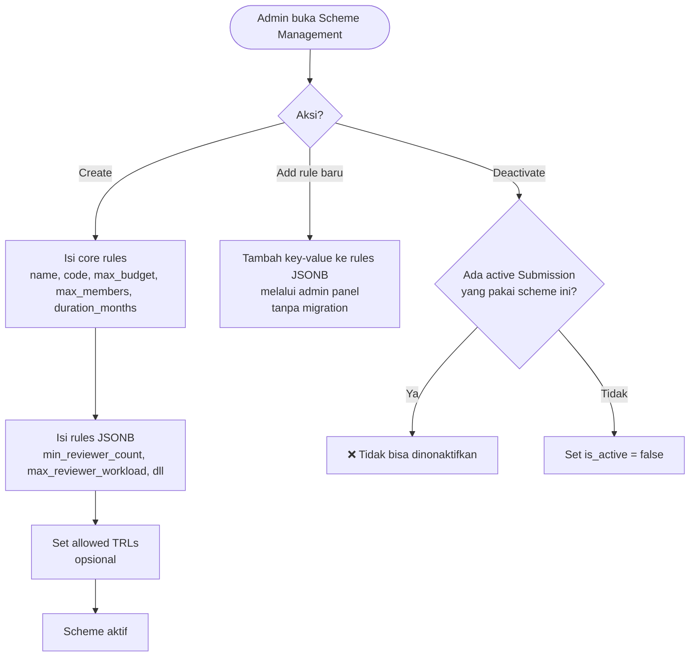
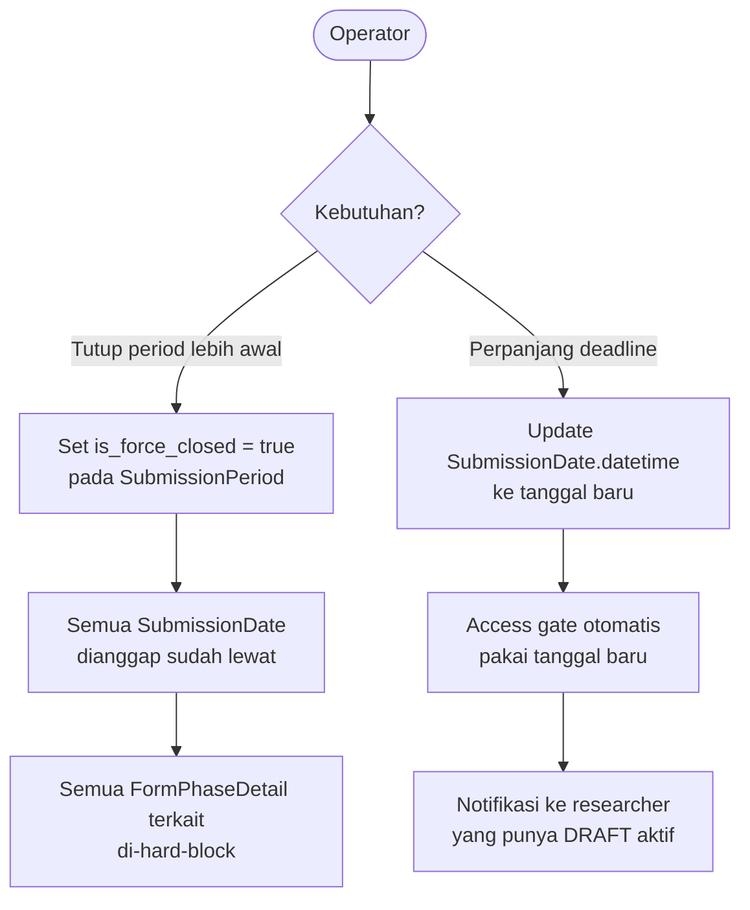
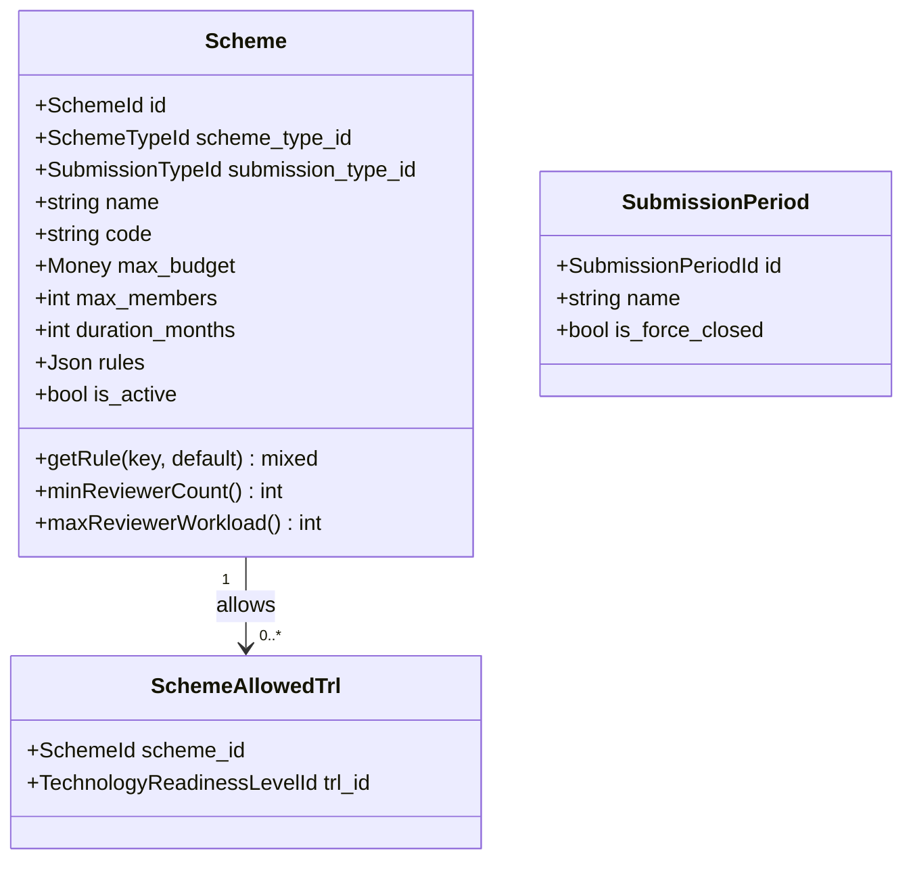

# BC: Scheme

**Klasifikasi:** 🟡 Supporting Domain  
**Versi:** 2.3  
**Status:** Draft

---

## Responsibility

Mengelola metadata aturan skema penelitian/pengabdian. Scheme **decoupled dari Form** — Form tidak mengetahui Scheme. Pemilihan Scheme dikontrol oleh FormField bertipe `scheme_selector` (opsional per Form). Core rules disimpan sebagai kolom terstruktur, rule opsional di JSONB `rules`.

---

## Activity Diagram

### Alur Konfigurasi Scheme



### Period Close Early / Extend



---

## Schema

```sql
schemes
  id
  scheme_type_id       FK → scheme_types
  submission_type_id   FK → submission_types
  name                 varchar
  code                 varchar UNIQUE
  max_budget           bigint          ← core rule, selalu ada
  max_members          int             ← core rule, selalu ada
  duration_months      int             ← core rule, selalu ada
  rules                jsonb nullable  ← extensible rules
  is_active            boolean

-- Contoh isi rules JSONB:
-- {
--   "min_reviewer_count": 2,
--   "max_reviewer_workload": 10,
--   "max_student_members": 5,
--   "require_external_reviewer": false,
--   "allowed_output_types": ["article", "book", "ip"]
-- }

scheme_allowed_trls
  scheme_id   FK → schemes
  trl_id      FK → technology_readiness_levels
```

---

## Akses Rules di Laravel

```php
class Scheme extends Model
{
    protected $casts = ['rules' => 'array'];

    public function getRule(string $key, mixed $default = null): mixed
    {
        return data_get($this->rules, $key, $default);
    }

    public function minReviewerCount(): int
    {
        return $this->getRule('min_reviewer_count', 2);
    }

    public function maxReviewerWorkload(): int
    {
        return $this->getRule('max_reviewer_workload', 10);
    }
}
```

---

## Field Type: `scheme_selector` & `trl_selector`

**`scheme_selector`** — dropdown berisi daftar Scheme yang tersedia di SubmissionPeriod aktif. Opsional per Form — kalau tidak ada field ini, submission berjalan tanpa Scheme.

**`trl_selector`** — dropdown TRL yang filtered berdasarkan Scheme terpilih. Hanya valid jika ada `scheme_selector` di Form yang sama.

Scheme ID tidak disimpan di `form_submissions` — hanya di `form_field_responses` sebagai value dari scheme_selector field. Ini single source of truth.

---

## Aggregates



---

## Business Rules

| Kode      | Rule                                                                                                                                |
| --------- | ----------------------------------------------------------------------------------------------------------------------------------- |
| BR-SCH-01 | Scheme tidak bisa di-deactivate jika ada active Submission yang menggunakannya                                                      |
| BR-SCH-02 | `max_budget > 0` dan `max_members > 0`                                                                                              |
| BR-SCH-03 | `code` unik di seluruh sistem                                                                                                       |
| BR-SCH-04 | Form tidak diwajibkan punya `scheme_selector` field — Scheme sepenuhnya opsional per Form                                           |
| BR-SCH-05 | `trl_selector` hanya valid jika ada `scheme_selector` di Form yang sama                                                             |
| BR-SCH-06 | Menambah rule baru ke `scheme.rules` JSONB tidak butuh migration — cukup update via admin panel                                     |
| BR-SCH-07 | Jika `SubmissionPeriod.is_force_closed = true`, semua FormPhaseDetail di period tersebut di-hard-block terlepas dari SubmissionDate |
| BR-SCH-08 | Perpanjangan deadline (update SubmissionDate) wajib diikuti notifikasi ke researcher yang punya DRAFT aktif                         |

---

## Integration Map

| Context              | Arah                | Keterangan                                                                |
| -------------------- | ------------------- | ------------------------------------------------------------------------- |
| Form Engine          | Lateral             | scheme_selector adalah FormField type — FE render UI, Scheme provide data |
| System Configuration | Upstream → Scheme   | SchemeTypeId, TRLId, SubmissionTypeId                                     |
| Submission           | Scheme → Downstream | max_budget, max_members, duration via form_field_responses                |
| Budget               | Scheme → Downstream | max_budget untuk validasi grand total                                     |
| Review               | Scheme → Downstream | min_reviewer_count dan max_reviewer_workload dari rules JSONB             |
