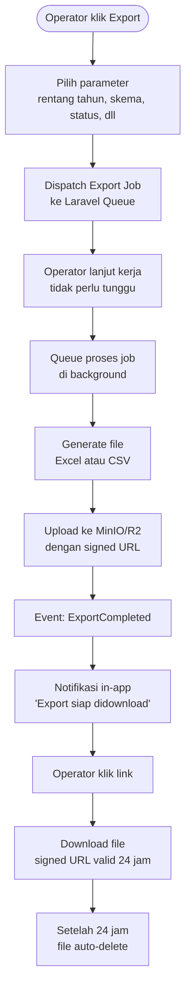
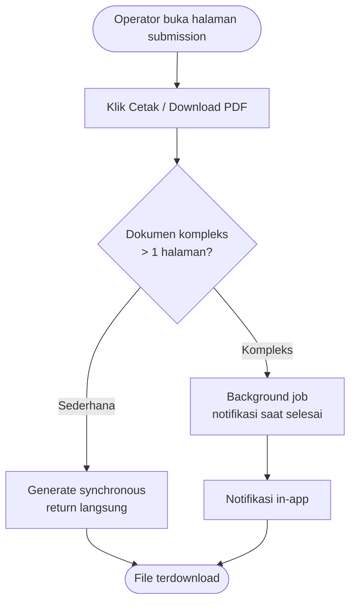
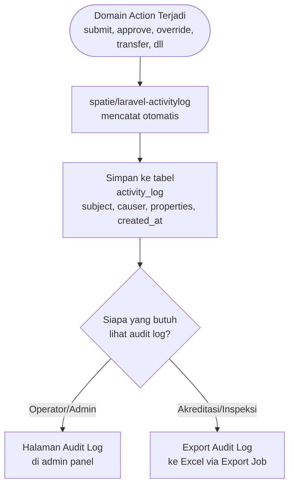

# BC: Reporting

**Klasifikasi:** 🟡 Supporting Domain  
**Versi:** 1.0  
**Status:** Draft

---

## Responsibility

Menghasilkan laporan, export data, dan audit trail untuk keperluan administratif LPPM. BC ini adalah **read-only consumer** dari semua context lain — tidak punya domain logic sendiri dan tidak mengubah state apapun.

Tiga output utama:

- **Statistik** — live query untuk dashboard operator/admin
- **Export Tabular** — Excel/CSV via background job
- **Cetak Dokumen** — PDF per submission
  Audit trail disimpan via `spatie/laravel-activitylog` dan domain owner-nya ada di BC ini — bukan di Observability.

---

## Activity Diagram

### Alur Export Besar (Background Job)

### Alur Cetak Dokumen PDF

### Alur Audit Trail

---

## Output Types

### 1. Statistik Dashboard (Live Query)

Ditampilkan di dashboard operator/admin. Di-query langsung dari DB — tidak ada caching khusus untuk skala SIMPAS.

| Statistik                          | Query Source                                                  |
| ---------------------------------- | ------------------------------------------------------------- |
| Jumlah submission per status       | `form_submissions`                                            |
| Submission per skema per tahun     | `form_submissions` + `form_field_responses` (scheme_selector) |
| Submission per fakultas/prodi      | `form_submissions` + `user_profiles` + `organizations`        |
| Total anggaran per periode         | `budget_line_items`                                           |
| Jumlah luaran per tipe             | `research_outputs`                                            |
| Distribusi reviewer per submission | `submission_reviewers`                                        |

### 2. Export Tabular (Background Job)

Package: **`maatwebsite/laravel-excel`**

| Export           | Isi                                                                      |
| ---------------- | ------------------------------------------------------------------------ |
| Rekap Submission | id, judul, status, scheme, lead researcher, tanggal submit, total budget |
| Detail Anggaran  | per submission + per line item                                           |
| Daftar Luaran    | per submission + per output type                                         |
| Rekap Monev      | per submission + per siklus + status                                     |
| Audit Log        | siapa, aksi apa, kapan, dari IP mana                                     |

### 3. Cetak Dokumen PDF

Package: **`barryvdh/laravel-dompdf`**

| Dokumen                       | Keterangan                               |
| ----------------------------- | ---------------------------------------- |
| Lembar Penilaian              | Hasil evaluasi reviewer per submission   |
| Surat Keterangan Diterima     | Template resmi setelah APPROVED          |
| Rekap Submission per Peneliti | Riwayat semua submission satu researcher |
| Laporan Monev                 | Ringkasan laporan kemajuan per siklus    |

---

## Audit Trail

Implementasi via `spatie/laravel-activitylog`. Aksi yang dicatat:

| Aksi                    | Subject                | Causer        |
| ----------------------- | ---------------------- | ------------- |
| `submitted`             | FormSubmission         | Researcher    |
| `reviewer_assigned`     | SubmissionReviewer     | Operator      |
| `evaluation_submitted`  | ReviewFormResponse     | Reviewer      |
| `revision_requested`    | ReviewSummary          | Reviewer      |
| `approved`              | FormSubmission         | System (auto) |
| `rejected`              | FormSubmission         | Operator      |
| `withdrawn`             | FormSubmission         | Operator      |
| `ownership_transferred` | FormSubmission         | Operator      |
| `override_created`      | FormSubmissionOverride | Operator      |
| `override_revoked`      | FormSubmissionOverride | Operator      |
| `reviewer_reassigned`   | SubmissionReviewer     | Operator      |
| `period_force_closed`   | SubmissionPeriod       | Operator      |
| `deadline_extended`     | SubmissionDate         | Operator      |

---

## Data Retention Policy

| Data                                               | Kebijakan                                    |
| -------------------------------------------------- | -------------------------------------------- |
| Submission APPROVED / REJECTED                     | Simpan permanen                              |
| Submission WITHDRAWN                               | Simpan permanen sebagai data historis        |
| DRAFT yang period-nya tutup                        | Simpan sebagai archived, read-only           |
| Tidak ada hard delete untuk data submission apapun |                                              |
| File export (Excel/PDF)                            | Auto-delete setelah 24 jam via scheduled job |
| Audit log                                          | Simpan permanen                              |

---

## Business Rules

| Kode      | Rule                                                                                                                                                                                                                                                                                                        |
| --------- | ----------------------------------------------------------------------------------------------------------------------------------------------------------------------------------------------------------------------------------------------------------------------------------------------------------- |
| BR-RPT-01 | Reporting hanya baca data — tidak boleh mengubah state apapun di context lain                                                                                                                                                                                                                               |
| BR-RPT-02 | Export besar (lebih dari 100 baris) harus via background job — tidak boleh synchronous                                                                                                                                                                                                                      |
| BR-RPT-03 | File export disimpan sementara di MinIO/R2 dengan signed URL time-limited 24 jam                                                                                                                                                                                                                            |
| BR-RPT-04 | Audit log tidak bisa dihapus — hanya append                                                                                                                                                                                                                                                                 |
| BR-RPT-05 | Operator bisa lihat audit log seluruh sistem, Researcher hanya bisa lihat audit log submission miliknya                                                                                                                                                                                                     |
| BR-RPT-06 | Statistik dashboard di-query live — tidak ada cache layer yang diperlukan untuk skala SIMPAS                                                                                                                                                                                                                |
| BR-RPT-07 | `ExportCompleted` event memicu notifikasi in-app ke operator yang request export tersebut                                                                                                                                                                                                                   |
| BR-RPT-08 | Export job yang gagal di-retry otomatis maksimal 3 kali dengan exponential backoff. Jika semua retry habis, operator yang request mendapat notifikasi in-app "Export gagal — coba lagi" dan error di-log ke Observability. Job tidak di-retry lagi setelah itu — operator harus request ulang secara manual |

---

## Domain Events

| Event             | Dipublish saat                                 | Consumer                                |
| ----------------- | ---------------------------------------------- | --------------------------------------- |
| `ExportCompleted` | Background job selesai generate file           | Notification                            |
| `ExportFailed`    | Semua retry habis, job tidak bisa diselesaikan | Notification (ke operator yang request) |

---

## Integration Map

| Context         | Arah                      | Keterangan                                   |
| --------------- | ------------------------- | -------------------------------------------- |
| Submission      | Upstream → Reporting      | Data submission, status, timeline            |
| Review          | Upstream → Reporting      | Data evaluasi, reviewer, revision history    |
| Budget          | Upstream → Reporting      | Data anggaran per submission                 |
| Research Output | Upstream → Reporting      | Data luaran per tipe                         |
| Monev           | Upstream → Reporting      | Data progress dan evaluasi monev             |
| Form Engine     | Upstream → Reporting      | Form field responses untuk detail submission |
| File Management | Reporting → OHS           | Simpan file export sementara                 |
| Notification    | Reporting → Cross-cutting | Publish ExportCompleted                      |
