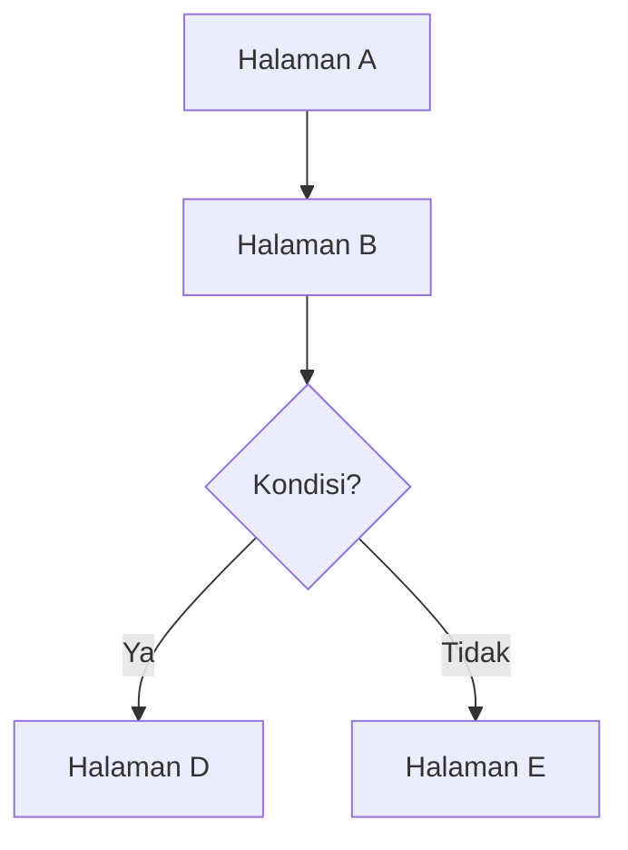

# IA: [Feature Area Name]

**Roles yang terlibat:** `Researcher` `Reviewer` `Operator` `Admin`  
**DDD Context:** [nama BC, contoh: Submission, Review, Form Engine]  
**Versi:** 1.0  
**Status:** Draft

---

## Page Inventory

Daftar semua halaman dalam feature area ini beserta siapa yang mengaksesnya.

| # | Page | Route | Accessible By |
|---|------|-------|---------------|
| 1 | [Nama halaman] | `/route/path` | Researcher |
| 2 | [Nama halaman] | `/route/path` | Operator, Admin |

---

## [Nama Page]

**Route:** `/route/path`  
**Accessible by:** [daftar role yang bisa akses]  
**Entry points:**
- [Dari mana user bisa sampai ke halaman ini — sidebar nav / tombol / redirect setelah aksi]

**Exit points:**
- [Kemana user pergi setelah selesai di halaman ini]

### Konten Utama

[Data dan informasi apa yang ditampilkan di halaman ini. Tulis dalam bentuk bullet atau paragraf singkat — bukan daftar field teknis.]

### Actions

| Aksi | Accessible By | Kondisi |
|------|---------------|---------|
| [Nama aksi] | Researcher | Selalu tersedia |
| [Nama aksi] | Operator | Hanya jika status = SUBMITTED |

### Business Rules yang Mempengaruhi Tampilan

- `→ ddd/[path]/[file].md#[kode-rule]` — [penjelasan singkat dampaknya ke UI, bukan isi rule-nya]
- `→ ddd/[path]/[file].md#[kode-rule]` — [penjelasan singkat]

---

## [Nama Page berikutnya]

[Ulangi struktur di atas untuk setiap halaman dalam feature area ini]

---

## Flow Diagram

[Opsional — gunakan mermaid jika alur antar halaman cukup kompleks untuk divisualisasikan]

---

## Catatan

[Hal-hal yang perlu diperhatikan yang tidak masuk ke bagian manapun di atas — keputusan desain, open questions, trade-off yang disepakati, dsb.]
