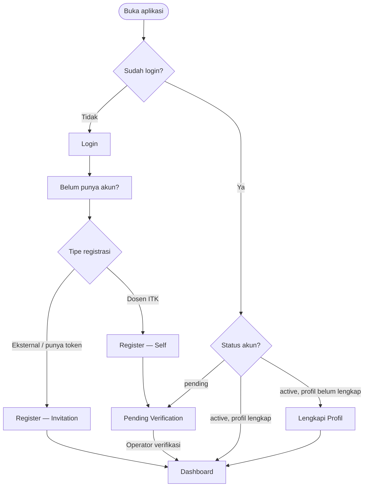

# IA: Authentication & Onboarding

**Roles yang terlibat:** `Researcher` `Reviewer` `Operator` `Admin`  
**DDD Context:** Identity & Access  
**Versi:** 1.0  
**Status:** Draft

---

## Page Inventory

| #   | Page                      | Route                           | Accessible By                                   |
| --- | ------------------------- | ------------------------------- | ----------------------------------------------- |
| 1   | Login                     | `/login`                        | Semua (unauthenticated)                         |
| 2   | Register — Self           | `/register`                     | Calon researcher ITK (unauthenticated)          |
| 3   | Register — via Invitation | `/register?token={token}`       | Calon researcher eksternal (unauthenticated)    |
| 4   | Pending Verification      | `/pending-verification`         | Researcher (status: pending)                    |
| 5   | Lengkapi Profil           | `/profile/complete`             | Researcher (status: active, profile incomplete) |
| 6   | Profil Saya               | `/profile`                      | Semua (authenticated)                           |
| 7   | Lupa Password             | `/forgot-password`              | Semua (unauthenticated)                         |
| 8   | Reset Password            | `/reset-password?token={token}` | Semua (unauthenticated)                         |

---

## Login

**Route:** `/login`  
**Accessible by:** Semua user yang belum login  
**Entry points:**

- Direct URL / bookmark
- Redirect dari halaman manapun saat session expired

**Exit points:**

- → Dashboard (jika login berhasil, status `active`)
- → Pending Verification (jika login berhasil, status `pending`)
- → Lupa Password

### Konten Utama

Form login dengan email dan password. Link ke halaman Lupa Password.

### Actions

| Aksi                      | Kondisi         |
| ------------------------- | --------------- |
| Login                     | Selalu tersedia |
| Navigasi ke Lupa Password | Selalu tersedia |

---

## Register — Self (Dosen ITK)

**Route:** `/register`  
**Accessible by:** Unauthenticated, hanya untuk email domain `@itk.ac.id`  
**Entry points:**

- Link dari halaman Login
- Direct URL

**Exit points:**

- → Pending Verification (setelah register berhasil)

### Konten Utama

Form registrasi: nama lengkap, email (`@itk.ac.id`), NIDN, password, konfirmasi password, dan OrgTreePicker untuk memilih unit organisasi (fakultas/prodi).

### Actions

| Aksi              | Kondisi                                           |
| ----------------- | ------------------------------------------------- |
| Submit registrasi | Email harus `@itk.ac.id`, semua field wajib diisi |

### Business Rules yang Mempengaruhi Tampilan

- `→ ddd/generic/02_identity_access.md#BR-IAM-01` — email non-`@itk.ac.id` langsung ditolak dengan inline error sebelum submit.
- `→ ddd/generic/02_identity_access.md#BR-IAM-02` — NIDN duplikat menghasilkan inline error setelah submit.

---

## Register — via Invitation Link (Eksternal)

**Route:** `/register?token={token}`  
**Accessible by:** Unauthenticated, memiliki invitation token valid  
**Entry points:**

- Link invitation yang dibagikan oleh Operator

**Exit points:**

- → Dashboard (setelah register berhasil — langsung active, tidak perlu verifikasi)
- → Halaman error token tidak valid / expired

### Konten Utama

Form registrasi: nama lengkap, email (bebas), password, konfirmasi password. Field organisasi dan permissions sudah pre-filled dari invitation token — ditampilkan sebagai read-only info, bukan input field.

### Actions

| Aksi              | Kondisi                              |
| ----------------- | ------------------------------------ |
| Submit registrasi | Token masih valid, semua field diisi |

### Business Rules yang Mempengaruhi Tampilan

- `→ ddd/generic/02_identity_access.md#BR-IAM-06` — jika token expired atau `used_count >= max_uses`, halaman menampilkan pesan error dan form tidak ditampilkan.

---

## Pending Verification

**Route:** `/pending-verification`  
**Accessible by:** Researcher dengan status `pending`  
**Entry points:**

- Redirect otomatis setelah self-register
- Redirect saat login dengan status `pending`

**Exit points:**

- → Dashboard (setelah operator memverifikasi dan user refresh/login ulang)

### Konten Utama

Halaman informasi status — bukan form. Menampilkan: pesan bahwa akun sedang menunggu verifikasi NIDN oleh operator LPPM, informasi kontak LPPM, dan NIDN yang sudah diinput (untuk referensi user jika ada salah input).

### Actions

| Aksi   | Kondisi         |
| ------ | --------------- |
| Keluar | Selalu tersedia |

### Business Rules yang Mempengaruhi Tampilan

- `→ ddd/generic/02_identity_access.md#BR-IAM-04` — user status `pending` bisa login tapi tidak bisa mengakses fitur apapun selain halaman ini.

---

## Lengkapi Profil

**Route:** `/profile/complete`  
**Accessible by:** Researcher dengan status `active` tapi profile belum lengkap  
**Entry points:**

- Redirect otomatis saat mencoba membuat submission dengan profile belum lengkap
- Link dari halaman Dashboard jika ada banner "lengkapi profil"

**Exit points:**

- → Submission create (jika masuk dari redirect submission)
- → Dashboard

### Konten Utama

Form melengkapi profil: nomor telepon, bidang keahlian, foto profil. Data dasar (nama, NIDN, organisasi) sudah ada dari registrasi — ditampilkan tapi tidak bisa diedit dari halaman ini.

### Actions

| Aksi          | Kondisi                 |
| ------------- | ----------------------- |
| Simpan profil | Semua field wajib diisi |

### Business Rules yang Mempengaruhi Tampilan

- `→ ddd/generic/02_identity_access.md#BR-IAM-03` — profil harus `isComplete()` sebelum bisa membuat submission.

---

## Profil Saya

**Route:** `/profile`  
**Accessible by:** Semua user authenticated  
**Entry points:**

- Topbar dropdown → "Profil Saya"

**Exit points:**

- Tetap di halaman yang sama setelah update berhasil

### Konten Utama

Edit profil: nama lengkap, nomor telepon, bidang keahlian, foto profil. NIDN dan email ditampilkan read-only (tidak bisa diubah sendiri).

### Actions

| Aksi           | Kondisi                               |
| -------------- | ------------------------------------- |
| Update profil  | Semua field wajib diisi               |
| Ganti password | Field password lama, baru, konfirmasi |

---

## Flow Diagram

