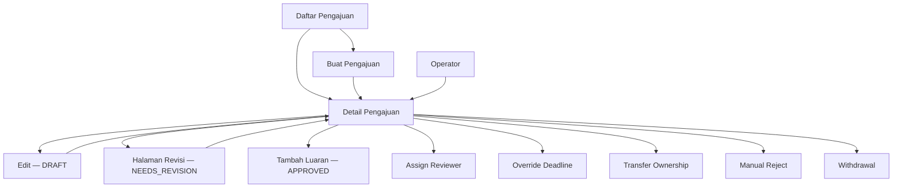

# IA: Submission

**Roles yang terlibat:** `Researcher` `Operator` `Admin`  
**DDD Context:** Submission, Form Engine  
**Versi:** 1.0  
**Status:** Draft

---

## Page Inventory

| # | Page | Route | Accessible By |
|---|------|-------|---------------|
| 1 | Daftar Pengajuan (Researcher) | `/submissions` | Researcher |
| 2 | Daftar Pengajuan (Operator) | `/submissions` | Operator, Admin |
| 3 | Buat Pengajuan | `/submissions/create` | Researcher |
| 4 | Detail Pengajuan | `/submissions/{id}` | Researcher, Reviewer, Operator, Admin |
| 5 | Edit Pengajuan (Draft) | `/submissions/{id}/edit` | Researcher (submitted_by, status DRAFT) |
| 6 | Halaman Revisi | `/submissions/{id}/revision` | Researcher (submitted_by, status NEEDS_REVISION) |
| 7 | Override Deadline | `/submissions/{id}/override` | Operator, Admin |
| 8 | Transfer Ownership | `/submissions/{id}/transfer` | Operator, Admin |
| 9 | Manual Reject | `/submissions/{id}/reject` | Operator, Admin |
| 10 | Withdrawal | `/submissions/{id}/withdraw` | Operator, Admin |

---

## Daftar Pengajuan — Researcher View

**Route:** `/submissions`  
**Accessible by:** Researcher  
**Entry points:**
- Sidebar nav → Pengajuan → Daftar Pengajuan

**Exit points:**
- → Buat Pengajuan (tombol CTA)
- → Detail Pengajuan (klik item)

### Konten Utama

Daftar semua submission di mana researcher adalah `submitted_by` atau terdaftar sebagai `research_member`. Dikelompokkan atau di-filter berdasarkan status dan periode.

### Actions

| Aksi | Accessible By | Kondisi |
|------|---------------|---------|
| Buat Pengajuan Baru | Researcher | SubmissionPeriod terbuka, profile lengkap |
| Lihat Detail | Researcher | Selalu |

### Business Rules yang Mempengaruhi Tampilan

- `→ ddd/core/01_submission.md#BR-SM-13` — submission DRAFT yang period-nya sudah tutup ditampilkan dengan badge "Archived" dan tidak bisa diedit.
- `→ ddd/core/01_submission.md#BR-SM-07` — submission yang user hanya menjadi `research_member` (bukan `submitted_by`) tetap ditampilkan tapi dengan label berbeda dan aksi terbatas.

---

## Daftar Pengajuan — Operator / Admin View

**Route:** `/submissions`  
**Accessible by:** Operator, Admin  
**Entry points:**
- Sidebar nav → Manajemen Pengajuan → Semua Pengajuan

**Exit points:**
- → Detail Pengajuan (klik item)

### Konten Utama

Tabel semua submission di sistem. Filter tersedia: status, periode, skema, organisasi pengusul, tanggal submit. Kolom: judul, lead researcher, skema, status, tanggal submit, aksi.

### Actions

| Aksi | Accessible By | Kondisi |
|------|---------------|---------|
| Filter & Search | Operator, Admin | Selalu |
| Lihat Detail | Operator, Admin | Selalu |
| Export | Operator, Admin | Redirect ke Reporting → Export Data |

---

## Buat Pengajuan (Wizard)

**Route:** `/submissions/create`  
**Accessible by:** Researcher  
**Entry points:**
- Tombol "Buat Pengajuan Baru" dari daftar pengajuan
- Sidebar nav → Pengajuan → Buat Pengajuan Baru

**Exit points:**
- → Detail Pengajuan (setelah submit berhasil)
- → Daftar Pengajuan (batalkan)

### Konten Utama

Multi-step wizard dengan progress indicator di sidebar/stepper. Step yang ada ditentukan oleh konfigurasi Form — tidak hardcoded. Umumnya mencakup:

1. **Pilih Form & Periode** — researcher pilih form pengajuan yang tersedia sesuai akses organisasinya
2. **Informasi Dasar** — isi FormFields scalar (judul, abstrak, keywords, dll)
3. **Skema & TRL** — jika form memiliki `scheme_selector` field (opsional)
4. **Anggota Penelitian** — tambah co-investigator dan anggota
5. **Rencana Anggaran** — input budget line items
6. **Upload Berkas** — proposal PDF (wajib) + berkas tambahan
7. **Review & Submit** — ringkasan semua input sebelum submit

### Actions

| Aksi | Accessible By | Kondisi |
|------|---------------|---------|
| Simpan Draft (auto) | Researcher | Setiap perubahan field |
| Navigasi antar step | Researcher | Step sebelumnya bisa diakses kapanpun; step berikutnya jika validasi step ini lulus |
| Submit | Researcher | Semua field required terpenuhi, proposal PDF ada |
| Batalkan | Researcher | Selalu (kembali ke daftar, draft tersimpan) |

### Business Rules yang Mempengaruhi Tampilan

- `→ ddd/core/01_submission.md#BR-SM-01` — jika researcher sudah punya active submission di period + scheme yang sama, tombol buat pengajuan di-disable dengan pesan.
- `→ ddd/core/01_submission.md#BR-SM-02` — tombol Submit di-disable selama proposal PDF belum diupload.
- `→ ddd/generic/01_form_engine.md#BR-FE-11` — Temporal Field Binding: field yang ditambahkan ke form setelah submission dibuat tidak di-enforce sebagai required.
- `→ ddd/generic/01_form_engine.md#BR-FE-01` — jika SubmissionPeriod sudah tutup saat user di tengah wizard, tampilkan pesan dan blok submit.

---

## Detail Pengajuan

**Route:** `/submissions/{id}`  
**Accessible by:** Researcher (own/member), Reviewer (assigned), Operator, Admin  
**Entry points:**
- Klik item dari daftar pengajuan
- Notifikasi (status berubah)
- Redirect setelah submit

**Exit points:**
- → Edit (jika DRAFT dan submitted_by)
- → Halaman Revisi (jika NEEDS_REVISION dan submitted_by)
- → Tambah Luaran (jika APPROVED)

### Konten Utama

Tampilan read-only lengkap dari submission: semua field responses, anggota penelitian, rencana anggaran, berkas yang diupload, status saat ini, dan timeline status history.

Tab atau section yang tersedia tergantung role dan status:

| Section | Visible To |
|---------|-----------|
| Informasi Pengajuan | Semua |
| Anggota Penelitian | Semua |
| Rencana Anggaran | Semua (Reviewer: hanya setelah APPROVED/REJECTED) |
| Berkas Lampiran | Semua |
| Hasil Review | Researcher (setelah APPROVED/REJECTED), Operator, Admin |
| Timeline & Audit | Operator, Admin |

### Actions

| Aksi | Accessible By | Kondisi |
|------|---------------|---------|
| Edit Pengajuan | Researcher (submitted_by) | Status DRAFT |
| Mulai Revisi | Researcher (submitted_by) | Status NEEDS_REVISION |
| Tambah Luaran | Researcher (submitted_by, co-investigator) | Status APPROVED |
| Assign Reviewer | Operator, Admin | Status SUBMITTED |
| Override Deadline | Operator, Admin | Selalu (jika ada deadline lewat) |
| Transfer Ownership | Operator, Admin | Ada Co-Investigator aktif |
| Reject Manual | Operator, Admin | Status UNDER_REVIEW |
| Withdrawal | Operator, Admin | Status APPROVED |
| Cetak PDF | Operator, Admin | Selalu |

### Business Rules yang Mempengaruhi Tampilan

- `→ ddd/core/01_submission.md#BR-SM-05` — status APPROVED/REJECTED/WITHDRAWN: tombol edit disembunyikan, semua konten read-only.
- `→ ddd/core/02_review.md#BR-REV-12` — hasil evaluasi reviewer hanya terlihat oleh researcher setelah status APPROVED atau REJECTED.
- `→ ddd/generic/01_form_engine.md#BR-FE-15` — FormPhaseDetail yang sudah expired tetap tampil read-only.

---

## Edit Pengajuan (Draft)

**Route:** `/submissions/{id}/edit`  
**Accessible by:** Researcher (submitted_by, status DRAFT)  
**Entry points:**
- Tombol Edit dari Detail Pengajuan

**Exit points:**
- → Detail Pengajuan

### Konten Utama

Identik dengan wizard Buat Pengajuan, tapi data sudah terisi dari draft yang ada. User bisa navigasi bebas antar step.

### Business Rules yang Mempengaruhi Tampilan

- `→ ddd/core/01_submission.md#BR-SM-12` — optimistic locking: jika ada concurrent edit, tampilkan pesan konflik dan minta user reload.

---

## Halaman Revisi

**Route:** `/submissions/{id}/revision`  
**Accessible by:** Researcher (submitted_by, status NEEDS_REVISION)  
**Entry points:**
- Notifikasi status berubah ke NEEDS_REVISION
- Tombol dari Detail Pengajuan

**Exit points:**
- → Detail Pengajuan (setelah resubmit)

### Konten Utama

Split view: catatan revisi dari reviewer (ReviewSummary + ReviewComments) di satu sisi, form edit submission di sisi lain. Researcher bisa reply ke komentar reviewer dari halaman ini.

### Actions

| Aksi | Accessible By | Kondisi |
|------|---------------|---------|
| Edit field / upload ulang | Researcher | Status NEEDS_REVISION |
| Reply komentar reviewer | Researcher | Ada ReviewComment yang open |
| Resubmit | Researcher | Ada perubahan setelah revision request |

### Business Rules yang Mempengaruhi Tampilan

- `→ ddd/core/01_submission.md#BR-SM-04` — hanya `submitted_by` yang bisa resubmit.
- `→ ddd/supporting/01_budget.md#BR-BUD-03` — budget tetap bisa diedit saat NEEDS_REVISION.

---

## Flow Diagram

