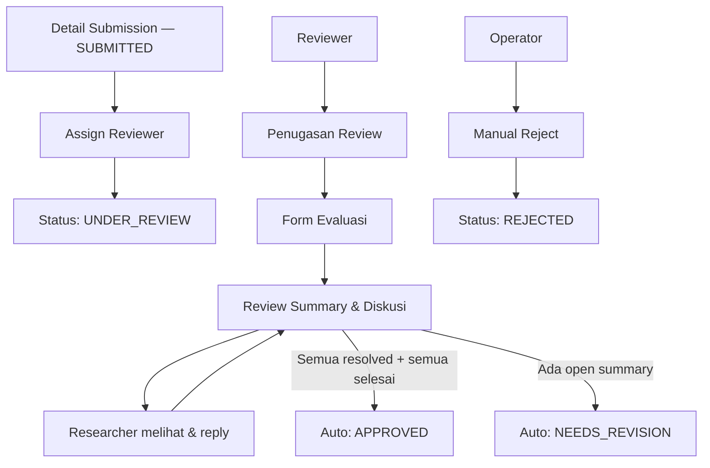

# IA: Review

**Roles yang terlibat:** `Reviewer` `Operator` `Admin`  
**DDD Context:** Review  
**Versi:** 1.0  
**Status:** Draft

---

## Page Inventory

| #   | Page                     | Route                                       | Accessible By                       |
| --- | ------------------------ | ------------------------------------------- | ----------------------------------- |
| 1   | Penugasan Review (list)  | `/review/assigned`                          | Reviewer                            |
| 2   | Riwayat Review           | `/review/history`                           | Reviewer                            |
| 3   | Form Evaluasi            | `/review/{submission_reviewer_id}/evaluate` | Reviewer                            |
| 4   | Review Summary & Diskusi | `/review/{submission_reviewer_id}/summary`  | Reviewer, Researcher (read + reply) |
| 5   | Assign Reviewer          | `/submissions/{id}/reviewers`               | Operator, Admin                     |
| 6   | Reassign Reviewer        | `/review/{submission_reviewer_id}/reassign` | Operator, Admin                     |

---

## Penugasan Review — List

**Route:** `/review/assigned`  
**Accessible by:** Reviewer  
**Entry points:**

- Sidebar nav → Penugasan Review

**Exit points:**

- → Form Evaluasi (klik submission yang pending)
- → Review Summary & Diskusi (klik submission yang completed, ada diskusi open)

### Konten Utama

Daftar submission yang di-assign ke reviewer ini. Dikelompokkan:

- **Perlu Tindakan** — `evaluation_status: pending`, atau ada ReviewSummary open yang butuh respon setelah researcher reply
- **Selesai** — `evaluation_status: completed`, semua ReviewSummary resolved

Setiap item menampilkan: judul submission, lead researcher, skema, deadline evaluasi, dan status saat ini.

### Actions

| Aksi                       | Kondisi                        |
| -------------------------- | ------------------------------ |
| Mulai / Lanjutkan Evaluasi | `evaluation_status: pending`   |
| Lihat Summary & Diskusi    | `evaluation_status: completed` |

### Business Rules yang Mempengaruhi Tampilan

- `→ ddd/core/02_review.md#BR-REV-09` — jika masa tugas reviewer sudah expired, halaman menampilkan banner informasi dan list menjadi read-only.

---

## Riwayat Review

**Route:** `/review/history`  
**Accessible by:** Reviewer  
**Entry points:**

- Sidebar nav → Riwayat Review

**Exit points:**

- → Detail Submission (read-only, klik item)

### Konten Utama

Semua submission yang pernah dievaluasi oleh reviewer ini, termasuk yang sudah replaced. Read-only. Termasuk submission dari monev cycles sebelumnya.

### Business Rules yang Mempengaruhi Tampilan

- `→ ddd/core/02_review.md#BR-REV-10` — record lama yang di-replace tetap tampil dengan label "Digantikan" — tidak dihapus.

---

## Form Evaluasi

**Route:** `/review/{submission_reviewer_id}/evaluate`  
**Accessible by:** Reviewer (yang di-assign)  
**Entry points:**

- Klik "Mulai Evaluasi" dari Penugasan Review list
- Notifikasi assignment baru

**Exit points:**

- → Review Summary & Diskusi (setelah submit evaluasi)

### Konten Utama

Split view:

- **Kiri / atas** — submission detail read-only: judul, abstrak, anggota, berkas proposal yang bisa dibuka
- **Kanan / bawah** — ReviewEvaluationForm: field-field penilaian kuantitatif dan kualitatif sesuai konfigurasi form

ReviewEvaluationForm bisa terdiri dari beberapa form (ReviewerFormAssignments) jika ada lebih dari satu form evaluasi per submission.

### Actions

| Aksi                  | Kondisi                     |
| --------------------- | --------------------------- |
| Simpan Draft Evaluasi | `status: draft`             |
| Submit Evaluasi       | Semua field required terisi |

### Business Rules yang Mempengaruhi Tampilan

- `→ ddd/core/02_review.md#BR-REV-08` — setelah submit, form menjadi locked read-only. Tombol edit disembunyikan.
- `→ ddd/core/02_review.md#BR-REV-11` — `reviewer_internal` bisa lihat skor reviewer lain setelah semua selesai. `reviewer_external` tidak bisa. Kontrol visibilitas ini aktif di halaman ini maupun di summary.

---

## Review Summary & Diskusi

**Route:** `/review/{submission_reviewer_id}/summary`  
**Accessible by:** Reviewer (write), Researcher (read + reply), Operator, Admin (read)  
**Entry points:**

- Redirect setelah submit evaluasi (Reviewer)
- Notifikasi NEEDS_REVISION (Researcher)
- Link dari Detail Submission (Operator/Admin)

**Exit points:**

- Tetap di halaman (diskusi berlanjut)
- → Penugasan Review list (Reviewer setelah semua resolved)

### Konten Utama

Dua area utama:

**ReviewSummary section** — status (open/resolved), catatan ringkasan dari reviewer, dan tombol untuk menandai resolved.

**Thread diskusi** — ReviewComments dalam struktur nested. Setiap komentar menampilkan: nama penulis, role (Reviewer / Researcher), waktu, dan isi komentar. Reply tersusun secara indent di bawah komentar parent.

### Actions

| Aksi                | Accessible By        | Kondisi                                   |
| ------------------- | -------------------- | ----------------------------------------- |
| Tulis komentar baru | Reviewer             | ReviewSummary status: open                |
| Reply komentar      | Reviewer, Researcher | ReviewSummary status: open                |
| Tandai resolved     | Reviewer             | Semua thread terjawab (judgment reviewer) |

### Business Rules yang Mempengaruhi Tampilan

- `→ ddd/generic/01_form_engine.md#BR-FE-06` — reviewer hanya bisa membuat ReviewSummary setelah `evaluation_status: completed`.
- `→ ddd/core/02_review.md#BR-REV-05` — jika semua ReviewSummary resolved dan semua evaluasi completed, sistem otomatis approve. Halaman menampilkan info bahwa submission akan diproses otomatis.
- `→ ddd/core/02_review.md#BR-REV-12` — researcher hanya bisa lihat summary setelah status NEEDS_REVISION ditetapkan (bukan selama under review).

---

## Assign Reviewer

**Route:** `/submissions/{id}/reviewers`  
**Accessible by:** Operator, Admin  
**Entry points:**

- Tombol "Assign Reviewer" dari Detail Pengajuan (status: SUBMITTED)
- Sidebar → Penugasan Reviewer (shortcut ke list)

**Exit points:**

- → Detail Pengajuan

### Konten Utama

Dua area: daftar reviewer yang sudah di-assign (bisa empty), dan form pencarian + penambahan reviewer baru.

Form pencarian reviewer menampilkan: nama, NIDN, tipe (internal/external), workload saat ini, dan status (aktif/expired). Reviewer yang punya conflict of interest dengan submission ini di-flag atau disembunyikan.

### Actions

| Aksi                  | Accessible By   | Kondisi                                             |
| --------------------- | --------------- | --------------------------------------------------- |
| Tambah reviewer       | Operator, Admin | Jumlah reviewer < batas maksimum skema              |
| Hapus reviewer        | Operator, Admin | `evaluation_status: pending` (belum mulai evaluasi) |
| Konfirmasi assignment | Operator, Admin | Jumlah reviewer ≥ `min_reviewer_count`              |

### Business Rules yang Mempengaruhi Tampilan

- `→ ddd/core/02_review.md#BR-REV-01` — tombol Konfirmasi di-disable selama jumlah reviewer belum ≥ `min_reviewer_count`. Ditampilkan counter: "2 dari minimal 2 reviewer".
- `→ ddd/core/02_review.md#BR-REV-02` — reviewer yang punya conflict of interest ditampilkan dengan badge "Konflik Kepentingan" dan tidak bisa dipilih.
- `→ ddd/core/02_review.md#BR-REV-04` — jika workload reviewer ≥ `max_reviewer_workload`, tampilkan warning kuning tapi masih bisa dipilih.

---

## Reassign Reviewer

**Route:** `/review/{submission_reviewer_id}/reassign`  
**Accessible by:** Operator, Admin  
**Entry points:**

- Tombol "Ganti Reviewer" dari halaman Assign Reviewer

**Exit points:**

- → Assign Reviewer / Detail Submission

### Konten Utama

Form untuk memilih reviewer pengganti. Reviewer lama ditampilkan dengan statusnya. Informasi history evaluasi yang sudah dilakukan reviewer lama tetap tersimpan.

### Business Rules yang Mempengaruhi Tampilan

- `→ ddd/core/02_review.md#BR-REV-10` — record reviewer lama di-mark `replaced`, tidak dihapus. Ditampilkan di history dengan label "Digantikan oleh [nama]".

---

## Flow Diagram

